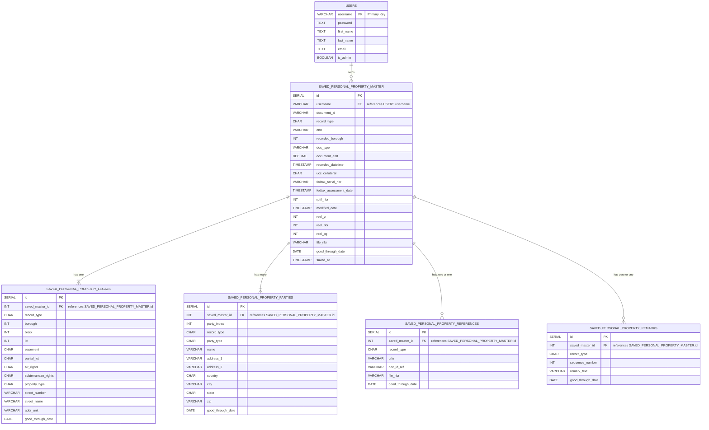

# snacris server (backend)

**TABLE OF CONTENTS**
- [snacris server (backend)](#snacris-server-backend)
- [Overview of SNACRIS](#overview-of-snacris)
  - [Features Implemented](#features-implemented)
  - [Technology Stack](#technology-stack)
  - [DATABASE SCHEMA \& THIRD PARTY API DIAGRAMS (ACRIS)](#database-schema--third-party-api-diagrams-acris)
    - [DATABASE SCHEMA](#database-schema)
      - [Users \& Real Property](#users--real-property)
      - [Users \& Personal Property](#users--personal-property)
      - [Users \& Favorites](#users--favorites)
    - [ACRIS DATASETS (THIRD PARTY API)](#acris-datasets-third-party-api)
      - [Real Property (Overview)](#real-property-overview)
      - [Real Property - Master](#real-property---master)
      - [Real Property - Legals](#real-property---legals)
      - [Real Property - Parties](#real-property---parties)
      - [Real Property - References](#real-property---references)
      - [Real Property - Remarks](#real-property---remarks)
      - [Personal Property (Overview)](#personal-property-overview)
      - [Personal Property - Master](#personal-property---master)
      - [Personal Property - Legals](#personal-property---legals)
      - [Personal Property - Parties](#personal-property---parties)
      - [Personal Property - References](#personal-property---references)
      - [Personal Property - Remarks](#personal-property---remarks)
      - [Code Mappings - Document Control Codes](#code-mappings---document-control-codes)
      - [Code Mappings - UCC Collateral Codes](#code-mappings---ucc-collateral-codes)
      - [Code Mappings - Property Type Codes](#code-mappings---property-type-codes)
      - [Code Mappings - State (USA) Codes](#code-mappings---state-usa-codes)
      - [Code Mappings - Country Codes](#code-mappings---country-codes)
    - [Data Flow - User Perspective](#data-flow---user-perspective)
    - [Real Property \& Personal Property APIs](#real-property--personal-property-apis)
      - [Fetches from the Real Property Master ACRIS dataset using Socrata Query Language (SoQL) syntax.](#fetches-from-the-real-property-master-acris-dataset-using-socrata-query-language-soql-syntax)
      - [Fetches from the Personal Property Master ACRIS dataset using Socrata Query Language (SoQL) syntax.](#fetches-from-the-personal-property-master-acris-dataset-using-socrata-query-language-soql-syntax)
      - [Methods](#methods)
    - [Socrata Query Language (SoQL) Utility Class - `SoqlUrl.js`](#socrata-query-language-soql-utility-class---soqlurljs)
      - [Internal Helpers](#internal-helpers)
  - [`snacrisForms` routes](#snacrisforms-routes)
    - [Summary](#summary)
      - [`queryAcrisAddressParcel.js`](#queryacrisaddressparceljs)
        - [Purpose](#purpose)
        - [Helpers: `findUniqueFullRecords(records: object[]): object[]`](#helpers-finduniquefullrecordsrecords-object-object)
        - [`analyzeResults(records: object[]): object`](#analyzeresultsrecords-object-object)
        - [Route: `GET /fetchRecord`](#route-get-fetchrecord)
        - [Response](#response)
      - [`queryAcrisPartyName.js`](#queryacrispartynamejs)
        - [Route: `GET /fetchRecord`](#route-get-fetchrecord-1)
        - [URL: `/snacrisForms/party-name/fetchRecord`](#url-snacrisformsparty-namefetchrecord)
        - [Query Parameters](#query-parameters)
        - [Response](#response-1)

# Overview of SNACRIS

- Unified Data Layer
15 APIs under the hood:

Real-Property (master, legals, parties, references, remarks)

Personal-Property (master, legals, parties, references, remarks)

Code Mappings (document classes, document types, boroughs, party types, UCC codes, etc.)

Code Mappings tables are pre-seeded from JSON key/value pairs to drive dropdowns and validate inputs when querying the Real- and Personal-Property endpoints.

- Search By Party Name
Mirrors ACRIS’s “Name” search:

Free-form individual (Last, First, MI, Suffix) or business name entry (all-caps).

Partial match on leading substrings (e.g. “SMI” returns SMITH, SMILEY, etc.).

Date range, Party type (Grantor/Grantee, Borrower/Lender…), and Borough filters.

Dropdowns populated dynamically from Code Mappings (party roles, borough list).

- Search By Parcel Identifier (BBL)
Borough–Block–Lot (+ unit):

Exact BBL → returns all records for that parcel.

BBL + unit → returns matching unit-level records.

Block only (lot=0000) → returns all lots in block.

Date range & Document class filters via Code Mappings.

- Search By Document Type & Class
Document Class dropdown (e.g. Deeds, Mortgages, Liens)

Document Type dropdown, filtered by chosen class

Date range (max 30 days) and Borough qualifiers

- Search By Document ID / CRFN
Enter either the 16-char Document ID or City Register File Number.

Returns the single cover‐page record with full metadata.

- Search By Transaction Number
Returns all docs sharing the same Transaction Number (grouping of related filings).

- Legacy Searches
Reel & Page (pre-ACRIS records, by Borough + Year + Reel + Page).

UCC / Federal Lien File Number (pre-2003 lien docs, by Borough + File Number).

## Features Implemented

- “Favorite” & “Save” Workflows
After any search, users can bookmark:

Entire document (all five sub-tables)

Single Party Name or Party Contact

Parcel Identifier (BBL)

Favorites persist via user-scoped tables (saved_party_names, saved_party_contacts, saved_properties) and reload automatically as dropdown/autocomplete options.

## Technology Stack

Front End: React + TypeScript, dynamic forms & results tables

Back End: Node.js/Express + PostgreSQL, with REST endpoints for each of the 15 APIs

Data Modeling: 10 relational tables for Real & Personal Property, plus 3 “favorites” tables and Code Mappings

Authentication: JWT Authentication with per-user favorites and CRUD

SNACRIS brings ACRIS’s full power to a modern web stack, enriched with code-driven dropdowns, “save for later” workflows, and a unified developer-friendly API layer.

## DATABASE SCHEMA & THIRD PARTY API DIAGRAMS (ACRIS) 

### DATABASE SCHEMA

#### Users & Real Property


#### Users & Personal Property



#### Users & Favorites


### ACRIS DATASETS (THIRD PARTY API)

#### Real Property (Overview)

NB--> Include this overview in the backend folder located here `snacris--backend/thirdPartyApi/acris/real-property/`


#### Real Property - Master


#### Real Property - Legals


#### Real Property - Parties


#### Real Property - References


#### Real Property - Remarks


#### Personal Property (Overview)

NB --> Include this overview in the backend folder located here: `snacris--backend/thirdPartyApi/acris/personal-property` 


#### Personal Property - Master


#### Personal Property - Legals


#### Personal Property - Parties


#### Personal Property - References


#### Personal Property - Remarks


#### Code Mappings - Document Control Codes

NB --> Include these relational ERD diagrams in the backend folder located here: `thirdPartyApi/acris/code-maps`


#### Code Mappings - UCC Collateral Codes


#### Code Mappings - Property Type Codes


#### Code Mappings - State (USA) Codes


#### Code Mappings - Country Codes


### Data Flow - User Perspective

When a user interacts with the front end of the Jobly application, the data flow involves several key files: `app.js`, `config.js`, `db.js`, and `server.js`. These files work together with the route files, schema files, and model files to handle user registration, authentication, and other interactions.

When a user registers, they submit a registration form on the front end. This form data is sent as a POST request to the `/auth/register` endpoint. The `authRoutes` in `app.js` handles this request. The `app.js` file sets up the Express application and configures middleware for handling CORS, JSON parsing, logging, and JWT authentication. It defines routes for authentication, companies, users, and jobs. The `authRoutes` validate the input data using the `userRegisterSchema` from the `schemas` folder. This validation ensures that the data conforms to the expected format before it is processed.

If the data is valid, the `User.register` method from the `user.js` model is called to create a new user in the database. The `user.js` model contains methods for interacting with the `users` table in the database. It handles hashing passwords and validating user data. The model inserts the user data into the database, and a JWT token is generated and returned to the front end.

For user authentication, the user submits a login form on the front end. This form data is sent as a POST request to the `/auth/token` endpoint. The `authRoutes` in `app.js` handle this request, validating the input data using the `userAuthSchema` from the `schemas` folder. If the data is valid, the `User.authenticate` method from the `user.js` model is called to verify the user's credentials. If the credentials are correct, a JWT token is generated and returned to the front end.

<!-- When the user interacts with various features on the front end, such as searching for documents, properties, or updating their profile, the front end sends requests to the corresponding endpoints (`/companies`, `/jobs`, `/users`). The routes in `app.js` handle these requests, validating the input data using the appropriate schemas from the `schemas` folder. The routes call the corresponding methods from the `company.js`, `job.js`, or `user.js` models to interact with the database. The models perform the necessary database operations and return the results to the routes. The routes then send the results back to the front end as responses. -->

The `config.js` file contains configuration settings for the application. It loads environment variables using `dotenv`, sets up constants like `SECRET_KEY` and `PORT`, and defines a function to get the database URI based on the environment. It also configures the bcrypt work factor for password hashing. This configuration is essential for setting up the environment and ensuring secure operations.

The `db.js` file sets up the connection to the PostgreSQL database using the `pg` library. It determines the database URI based on the environment and configures SSL for production. It exports the connected database client for use in other parts of the application. This database connection is crucial for storing and retrieving data.

Finally, the `server.js` file is the entry point for the backend server. It imports the Express application from `app.js` and starts the server on the specified port. The port number is retrieved from the configuration file. This file ensures that the server is running and listening for incoming requests.

In summary, the backend server application for Jobly handles user registration, authentication, and interactions with the front end through a well-structured flow of data. The `app.js`, `config.js`, `db.js`, and `server.js` files work together with the route files, schema files, and model files to ensure that data is validated, processed, and stored correctly, providing a seamless experience for the user.

[BACK TO TOC](#snacris-server-backend)

### Real Property & Personal Property APIs

#### Fetches from the Real Property Master ACRIS dataset using Socrata Query Language (SoQL) syntax.

MasterRealPropApi.js - Real Property Master Dataset
LegalsRealPropApi.js - Real Property Legals Dataset
PartiesRealPropApi.js - Real Property Parties Dataset
ReferencesRealPropApi.js - Real Property References Dataset
RemarksRealPropApi.js - Real Property Remarks Dataset

#### Fetches from the Personal Property Master ACRIS dataset using Socrata Query Language (SoQL) syntax.

MasterPersPropApi.js - Personal Property Master Dataset
LegalsPersPropApi.js - Personal Property Legals Dataset
PartiesPersPropApi.js - Personal Property Parties Dataset
ReferencesPersPropApi.js - Personal Property References Dataset
RemarksPersPropApi.js - Personal Property Remarks Dataset

#### Methods

Each class exposes five core methods (`fetchAcrisRecords`, `fetchAcrisRecordCount`, `fetchAcrisDocumentIds`, `fetchAcrisDocumentIdsCrossRef`, and `fetchAcrisRecordsByDocumentIds`) to (1) page through full record sets, (2) count matches, (3) retrieve IDs only, (4) cross-reference against another ID list in batches, and (5) fetch full records by batches of document IDs. Under the hood they all delegate URL construction to your `SoqlUrl` utility, which composes the appropriate Socrata `$select`, `$where`, `$limit`, and `$offset` clauses for each data domain, keeping your API clients perfectly DRY and consistent.

`fetchAcrisRecords(masterQueryParams: object, limit?: number = 1000): Promise<object[]>`
- Purpose: Paginate through all matching master records.
- Params:
    - masterQueryParams – filter fields (e.g. document_id, crfn, recorded_borough, doc_type, date ranges, etc.).
    - limit – page size (default 1000).
- Returns: Promise of an array of record objects.
- Errors:
    - Throws NotFoundError if the first page returns no data.
    - Throws generic Error on HTTP or parsing failure.

`fetchAcrisRecordCount(masterQueryParams: object): Promise<number>`
- Purpose: Retrieve count(*) of matching master records.
- Returns: record count as number.
- Errors:
    - Throws NotFoundError if count missing.
    - Throws generic Error otherwise.

`fetchAcrisDocumentIds(masterQueryParams: object, limit?: number = 1000): Promise<string[]>`
- Purpose: Paginate through $select=document_id only, collecting unique IDs.
- Returns: Deduplicated string[] of document_id.
- Errors:
    - Throws NotFoundError if none found.
    - Throws generic Error on HTTP issues.

`fetchAcrisDocumentIdsCrossRef(masterQueryParams: object, crossRefIds: string[], batchSize?: number = 500): Promise<string[]>`
- Purpose: Given another set of IDs (e.g. from Legals), batch‐query master for intersecting document_id.
- Params:
    - crossRefIds – IDs to filter by in document_id IN (…).
    - batchSize – number of IDs per batch.
- Returns: Array of matching master document_id.
- Errors:
    - Throws NotFoundError if no matches across all batches.
    - Throws generic Error on failure.

`fetchAcrisRecordsByDocumentIds(documentIds: string[], queryParams?: object, limit?: number = 1000): Promise<object[]\|null>`
- Purpose: Retrieve full master records for a given list of document_id.
- Behavior: Batches into chunks of ~75 IDs, paginates each batch.
- Returns: Array of record objects or null if no data.
- Errors:
    - Returns null (rather than throwing) if nothing found.
    - Logs and throws no further errors on HTTP failures.

### Socrata Query Language (SoQL) Utility Class - `SoqlUrl.js`

Central utility for building Socrata (SoQL) URLs across all ACRIS‐wrapper modules.

`escapeSoqlString(val: any): string`
- Purpose: Safely escape single quotes in arbitrary values so they can be safely interpolated into SoQL string literals.
- Signature: `static escapeSoqlString(val: any): string`
- Parameters:
    - `val`: any JavaScript value (string, number, null, undefined).
- Returns:
    - A string with all single-quotes (') doubled ('').
    - If val is null or undefined, returns the empty string "".
- Errors:
    - Never throws.

`constructUrl(queryParams, apiCaller, selectOption, limit, offset): string`
- Purpose: Build a complete SoQL request URL including `$select`, `$where`, `$limit` and `$offset`, based on the parameters for a given dataset.
- Signature: 

```js
static constructUrl(
  queryParams: object,
  apiCaller: string,
  selectOption?: string | string[] | null,
  limit?: number,
  offset?: number
): string
```

- Parameters:
    - `queryParams` (object): key/value pairs corresponding to filterable fields for the target dataset (e.g. `{ document_id: "ABC123", borough: 1 }`).
    - `apiCaller` (string): name of caller class (e.g. "`MasterRealPropApi`") used to select the correct base endpoint.
    - `selectOption` (string | string[] | null, default `"records"`):
        - `"records"`: no `$select`—return full rows
        - `"document_id"`: `$select=document_id`
        - `"countAll"`: `$select=count(*)`
        - `string[]`: array of field names to include in `$select=…`
    - `limit` (number, optional): value for `$limit`.
    - `offset` (number, optional): value for `$offset`.
- Returns:
    - A `string` URL pointing at the configured Socrata endpoint, with the assembled query string.
- Errors:
    - Throws `Error` if `queryParams` is not an object.
    - Throws `Error` if `apiCaller` is not a non-empty string or not recognized.
    - Throws `Error` if `selectOption` is invalid (not one of the allowed values).

`constructUrlForDocumentIds(queryParams, apiCaller, documentIds, limit, offset): string`
- Purpose: Like `constructUrl`, but forcibly injects a `document_id IN (…)` condition into the `$where` clause for direct lookup by a batch of IDs.
- Signature:

```
static constructUrlForDocumentIds(
  queryParams: object,
  apiCaller: string,
  documentIds: string[],
  limit?: number,
  offset?: number
): string
```

- Parameters:
    - `queryParams` (object): same as above.
    - `apiCaller` (string): as above.
    - `documentIds` (string[]): non-empty array of document IDs to match.
    - `limit` (number, optional) and `offset` (number, optional): for pagination.
- Returns:
    - A `string` URL including both the usual `$where` conditions and `document_id IN ('ID1','ID2',…)`.
- Errors:
    - Throws `Error` if `documentIds` is not a non-empty array.
    - Propagates errors from `constructUrl` for invalid callers or params.

`constructUrlBatches(queryParams, documentIds, apiCaller, batchSize): string[]`
- Purpose: Break a large array of `documentIds` into batches and return an array of SoQL URLs—one per batch—using `constructUrlForDocumentIds`.
- Signature:

```js
static constructUrlBatches(
  queryParams: object,
  documentIds: string[],
  apiCaller: string,
  batchSize?: number
): string[]
```

- Parameters:
    - `queryParams` (object) and `apiCaller` (string): passed through to `constructUrlForDocumentIds`.
    - `documentIds` (string[]): full list of IDs to batch.
    - `batchSize` (number, default 500): max IDs per URL.
- Returns:
    - An array of `string` URLs, each filtering on a slice of up to `batchSize` IDs.
- Errors:
    - Throws `Error` if `documentIds` is not an array or `batchSize` is not a positive number.

#### Internal Helpers
These methods are used by the above but can be considered private implementation details:

- `setConditionsConfig(queryParams: object, apiCaller: string): string[]`
    - Builds the array of individual `field = 'value'` or `field IN (…)` conditions.

- `setSelectConfig(selectOption: string | string[] | null): string`
    - Returns the `$select=…` clause or empty string for `"records"`.

- `setWhereConfig(conditions: string[]): string`
    - URL-encodes and joins the conditions with `AND` into a `$where=…` clause.

- `setApiEndpointConfig(apiCaller: string): string`
    - Maps `apiCaller` names to the base Socrata endpoint URLs you’ve defined.

`setLimitOffsetConfig(selectOption: string | string[] | null, limit?: number, offset?: number): string`
    - Builds the `$limit`/`$offset` clause (skipped for `countAll`).

`batchArray(array, batchSize): any[][]`
    - Divide an input array into sub-arrays (“batches”) of a given maximum size, preserving order.

All of these helpers throw if given invalid arguments (e.g. unknown caller, malformed params).

## `snacrisForms` routes

### Summary 

All files under snacrisForms/ are Express route modules that:
- Accept query parameters from the frontend's React forms (e.g. address/parcel inputs or party-name inputs).
- Invoke the appropriate ACRIS-wrapper API classes (via `SoqlUrl`) to fetch IDs, full records, or both.
- Post-process the raw JSON results (dedupe, summarize, collate).
- Return JSON responses shaped for your front-end components (tables, dropdowns, analysis panels).

Every external fetch uses the shared SoqlUrl utility to assemble Socrata URLs, ensuring a consistent `$select`/`$where`/`$limit`/`$offset` strategy across all 10 Real Property & Personal Property API modules.

#### `queryAcrisAddressParcel.js`

##### Purpose

Power your “Search by Parcel Identifier” form, fetching Real-Property Legals records for a given BBL (and optional co-op unit), then analyzing consistency and exceptions across the result set.

##### Helpers: `findUniqueFullRecords(records: object[]): object[]`
- What it does: Removes duplicate rows except for `document_id`. Internally strips out `document_id`, stringifies the rest as an identifier, and then re-attaches the original `document_id` to the first occurrence.
- Inputs:
    - records – an array of raw Socrata record objects.
- Outputs:
    - A deduplicated array, preserving the full original objects (including one document_id per unique “content”).

##### `analyzeResults(records: object[]): object`
- What it does:
For each key in `["borough","block","lot","street_number","street_name","record_type","easement","partial_lot","air_rights","subterranean_rights","property_type"]`, it:
    - Counts how many times each distinct value appears.
    - Sorts values by descending frequency.
    - Computes a consistency metric (“most‐common count/total”).
    - Lists all “exceptions” (less‐common values with their own doc IDs).
- Inputs:
    - `records` – the (optionally deduped) array of full Legals records.
- Outputs:
    - An object mapping each key to its sorted value list, plus `key_consistency` and `key_exceptions` arrays.

##### Route: `GET /fetchRecord`
- URL `/snacrisForms/address-parcel/fetchRecord`
- Query Parameters
    - Group A (parcel search):
        - borough (integer, required if no street lookup)
        - block (integer)
        - lot (integer)
    - Group B (address search):
        - borough (integer)
        - street_number (string)
        - street_name (string)
        - unit (string, optional—co-op unit)

Must supply at least one of Group A or Group B parameters; all values are URL-escaped via `transformForUrl()`.

##### Response
- Success (HTTP 200)

```json
{
  "status": "success",
  "message": "Analysis complete for X records.",
  "analysis": { /* as returned by analyzeResults() */ }
}
```

- No Matches (HTTP 200)

```json
{
  "status": "failed",
  "message": "No records found for the provided query parameters.",
  "records": []
}
```

- Bad Request (HTTP 400)

```json
{
  "status": "error",
  "message": "At least one query parameter is required.",
  "records": []
}
```

- Unexpected Error is forwarded to your global error handler.

#### `queryAcrisPartyName.js`

Purpose: Power your “Search by Party Name” form, cross‐referencing Master → Parties → Legals to produce a full suite of Real-Property records (master, parties, legals, references, remarks) for each matching `document_id`.

##### Route: `GET /fetchRecord`
##### URL: `/snacrisForms/party-name/fetchRecord`
##### Query Parameters

```js
req.query = {
  masterSearchTerms: {
    recorded_date_range?, recorded_date_start?, recorded_date_end?,
    doc_class?, doc_type?
  },
  partySearchTerms: {
    name?, party_type?
  },
  legalsSearchTerms: {
    borough?
  }
}

```

- Date filtering and doc-class → doc-type lookups via DocTypesCodeMapModel.

- Name is wildcard-matched (LIKE '%…%'), party_type filters, and borough refines legals.

**Processing Steps**
1. Fetch master IDs matching masterSearchTerms.
2. Cross-ref those IDs against the Parties API to further narrow by name/type.
3. Cross-ref party IDs against the Legals API for borough filter.
4. If any step fails or yields zero IDs, return { dataFound: false, errMsg: […] }.
5. Otherwise parallel‐fetch full records for each of the five sub-datasets by document_id.
6. Collate into an array of { document_id, masterRecords, partyRecords, legalsRecords, referencesRecords, remarksRecords }.
7. Respond { dataFound: true, results: […] }.

##### Response
- Success

```json
{
  "dataFound": true,
  "results": [
    {
      "document_id": "ABC123",
      "masterRecords": [ /* … */ ],
      "partyRecords":  [ /* … */ ],
      "legalsRecords": [ /* … */ ],
      "referencesRecords": [ /* … */ ],
      "remarksRecords": [ /* … */ ]
    },
    /* more docs… */
  ]
}
```

- No IDs or Errors

```json
{
  "dataFound": false,
  "errMsg": [
    "Master IDs: …",
    "Party IDs: …",
    /* etc. */
  ]
}
```
