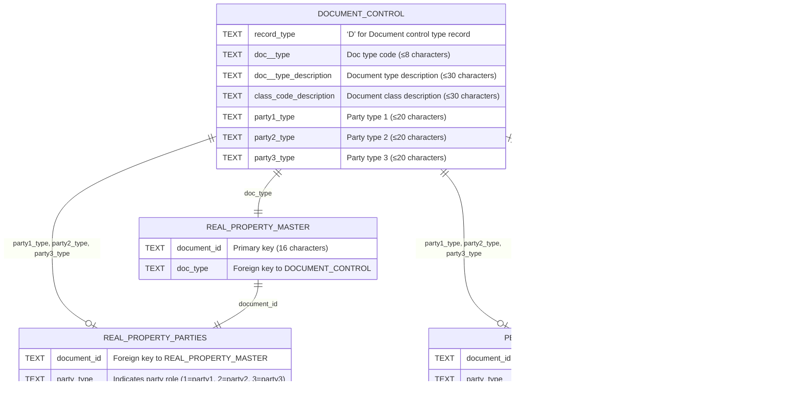

# ACRIS CODE MAPPING DATASETS

## Overview

These five code mapping datasets serve as **reference data** for the ACRIS (Automated City Register Information System) database. They provide lookup tables and validation data that are essential for querying and interpreting the other 10 primary datasets:

- **5 Real Property datasets** (Master, Parties, Legals, References, Remarks)
- **5 Personal Property datasets** (Master, Parties, Legals, References, Remarks)

### Purpose and Usage

The code mapping datasets function as:

- **Foreign key references** for maintaining data integrity
- **Lookup tables** for form population and data validation on the frontend
- **Translation maps** for converting codes to human-readable descriptions
- **Query filters** for searching and filtering the main property datasets

### Data Modification Likelihood

While all models include full CRUD operations (Create, Read, Update, Delete), the frequency of changes varies significantly across datasets:

**Most Stable (Rarely Updated):**

- `UccTypesCodeMapModel` - UCC collateral types are standardized, though new violation types may occasionally be added
- `StatesCodeMapModel` - U.S. state codes are stable, but new territories could be added
- `CountryCodeMapModel` - Country codes are relatively stable, though country name updates may occur

**Moderately Dynamic:**

- `PropTypesCodeMapModel` - New property types may be added as real estate development evolves
- `DocTypesCodeMapModel` - New document types may be introduced as legal and financial instruments evolve

**Note:** These datasets are primarily maintained by NYC's Department of Finance and reflect official ACRIS data standards. Local modifications should be rare and carefully coordinated with official data sources.

### Code Mappings - Document Control Codes

### Code Mappings - UCC Collateral Codes

### Code Mappings - Property Type Codes

### Code Mappings - State (USA) Codes

### Code Mappings - Country Codes

