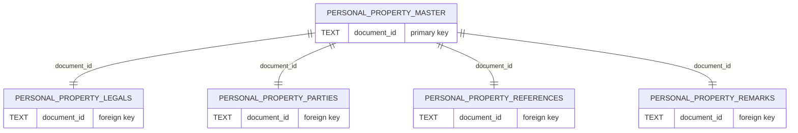

# Personal Property Model

This module provides functionality for managing saved personal property documents from the ACRIS (Automated City Register Information System) database. It handles UCC filings, federal tax liens, and other personal property transactions with complete lifecycle management including creation, retrieval, updating, and deletion.

## Overview

The Personal Property model manages complex relational data consisting of:

- **Master Record**: Core document information (document ID, type, amount, dates, UCC collateral info, federal tax details, etc.)
- **Legal Records**: Property location details (borough, block, lot, address)
- **Party Records**: Involved parties (debtors, creditors, lenders, taxpayers, etc.)
- **Reference Records**: Cross-references to other documents
- **Remark Records**: Additional notes and comments




## Document Types

Personal property documents in ACRIS include:

- **UCC Filings**: Uniform Commercial Code security interests in personal property
- **Federal Tax Liens**: IRS liens on personal property for unpaid taxes
- **Other Personal Property**: Various other non-real estate transactions

## Functions

### `getSavedPersonalPropertyDocument(username, documentId = null)`

Retrieves saved personal property documents for a specific user.

**Parameters:**

- `username` (string): The username of the document owner
- `documentId` (string, optional): Specific document ID to retrieve

**Returns:**

- If `documentId` provided: Single document object or `null` if not found
- If `documentId` omitted: Array of all documents for the user

**Example:**

```javascript
// Get all documents for a user
const allDocs = await getSavedPersonalPropertyDocument("john_doe");

// Get specific document
const doc = await getSavedPersonalPropertyDocument(
  "john_doe",
  "2023456789012001"
);
```

### `savePersonalPropertyDocument(username, docInput)`

Saves (inserts or updates) a complete personal property document in a single transaction.

**Parameters:**

- `username` (string): The username of the document owner
- `docInput` (object): Document data with master, legals, parties, references, remarks

**Returns:**

- `masterId` (number): The database ID of the saved master record

**Features:**

- **Upsert Functionality**: Updates existing documents when same username/document_id combination exists
- **Data Sanitization**: Converts empty strings to `null` values for proper database storage
- **Transaction Safety**: Uses database transactions to ensure data consistency
- **Cascading Updates**: Clears and rebuilds all child records on updates

**Example:**

```javascript
const docData = {
  master: {
    document_id: "2023456789012001",
    record_type: "A",
    crfn: "2023000456001",
    recorded_borough: 1,
    doc_type: "UCC",
    document_amt: 250000.0,
    recorded_datetime: "2023-11-10T14:30:00",
    ucc_collateral: "Y",
    fedtax_serial_nbr: null,
    fedtax_assessment_date: null,
    rpttl_nbr: null,
    modified_date: "2023-11-10T14:30:00",
    file_nbr: "PP00000001",
    good_through_date: "2023-12-31",
    // ... other master fields
  },
  legals: [
    {
      /* legal record data */
    },
  ],
  parties: [
    {
      /* party record data */
    },
  ],
  references: [
    {
      /* reference record data */
    },
  ],
  remarks: [
    {
      /* remark record data */
    },
  ],
};

const masterId = await savePersonalPropertyDocument("john_doe", docData);
```

### `deletePersonalPropertyDocument(username, documentId)`

Deletes a saved personal property document and all its related child records.

**Parameters:**

- `username` (string): The username of the document owner
- `documentId` (string): The document ID to delete

**Returns:**

- `masterId` (number): The database ID of the deleted master record, or `null` if not found

**Features:**

- **User Isolation**: Only deletes documents owned by the specified user
- **Cascading Deletes**: Automatically removes all related child records via database constraints

## Recent Changes (June 2025)

### 1. Fixed Database Connection Issues

**Problem**: The original model used `db.getClient()` which doesn't exist in the current database module.

**Solution**: Updated to use the same connection pattern as the real property model:

```javascript
const client = db;
// Instead of: const client = await db.getClient();
```

**Impact**:

- Model now works with the current database setup
- Consistent connection handling across all models

### 2. Enhanced Upsert Functionality

**Problem**: The original `ON CONFLICT` clause only updated the `modified_date` field, causing incomplete updates when documents were re-saved.

**Solution**: Updated the upsert query to properly update all master record fields:

```sql
ON CONFLICT (username, document_id) DO UPDATE SET
  record_type = EXCLUDED.record_type,
  crfn = EXCLUDED.crfn,
  recorded_borough = EXCLUDED.recorded_borough,
  doc_type = EXCLUDED.doc_type,
  document_amt = EXCLUDED.document_amt,
  recorded_datetime = EXCLUDED.recorded_datetime,
  ucc_collateral = EXCLUDED.ucc_collateral,
  fedtax_serial_nbr = EXCLUDED.fedtax_serial_nbr,
  fedtax_assessment_date = EXCLUDED.fedtax_assessment_date,
  rpttl_nbr = EXCLUDED.rpttl_nbr,
  modified_date = EXCLUDED.modified_date,
  reel_yr = EXCLUDED.reel_yr,
  reel_nbr = EXCLUDED.reel_nbr,
  reel_pg = EXCLUDED.reel_pg,
  file_nbr = EXCLUDED.file_nbr,
  good_through_date = EXCLUDED.good_through_date
```

**Impact**:

- Documents can now be properly updated with new values
- Tests for upsert functionality now pass
- Data integrity maintained across updates

### 3. Added Cascading Update Support

**Problem**: The `batchInsert` helper function didn't support clearing existing child records during updates.

**Solution**: Enhanced the function to support cascading updates:

```javascript
async function batchInsert(table, rows, cols, clearExisting = false) {
  // Clear existing records for this master if specified
  if (clearExisting) {
    await client.query(`DELETE FROM ${table} WHERE saved_master_id = $1`, [
      mid,
    ]);
  }
  // ... rest of function
}
```

**Impact**:

- Proper update behavior for child records
- Prevents duplicate child records during updates
- Maintains data consistency

### 4. Fixed Module Path

**Problem**: Incorrect require path for database module (`../db` instead of `../../../db`).

**Solution**: Corrected the import path to match the project structure.

**Impact**:

- Module now loads correctly
- Tests can run successfully

## Data Structure

### Master Record Fields

- `username`: Document owner
- `document_id`: Unique document identifier
- `record_type`: Record classification
- `crfn`: Control Reference Number
- `recorded_borough`: NYC borough code (1-5)
- `doc_type`: Document type (UCC, FXTAX, etc.)
- `document_amt`: Transaction amount
- `recorded_datetime`: Recording timestamp
- `ucc_collateral`: UCC collateral indicator (Y/N)
- `fedtax_serial_nbr`: Federal tax serial number
- `fedtax_assessment_date`: Federal tax assessment date
- `rpttl_nbr`: Report title number
- `modified_date`: Last modification timestamp
- `reel_yr`, `reel_nbr`, `reel_pg`: Microfilm reference
- `file_nbr`: File number
- `good_through_date`: Data validity date

### UCC-Specific Fields

- `ucc_collateral`: Indicates if this is a UCC collateral filing
- `file_nbr`: UCC filing number

### Federal Tax-Specific Fields

- `fedtax_serial_nbr`: IRS serial number for tax liens
- `fedtax_assessment_date`: Date of tax assessment
- `rpttl_nbr`: Report title number for tax documents

### Child Record Types

- **Legals**: Property location and type information (1:1 with master)
- **Parties**: People and entities involved in the transaction (1-3 per master)
- **References**: Links to related documents (0-1 per master)
- **Remarks**: Additional notes and comments (0-1 per master)

## Database Schema

The model uses the following tables:

- `saved_personal_property_master` (main record)
- `saved_personal_property_legals` (property details, 1:1)
- `saved_personal_property_parties` (involved parties, 1-3 per master)
- `saved_personal_property_references` (document references, 0-1 per master)
- `saved_personal_property_remarks` (additional notes, 0-1 per master)

All child tables have foreign key constraints with `ON DELETE CASCADE` to maintain referential integrity.

### Key Constraints

- **Unique Constraint**: `(username, document_id)` on master table prevents duplicate saves
- **Party Index Constraint**: `(saved_master_id, party_index)` ensures unique party ordering
- **Single Child Records**: References and remarks tables have unique constraints per master

## Error Handling

The model includes comprehensive error handling:

- Database transaction rollback on errors
- User isolation validation
- Data constraint validation
- Graceful handling of missing or invalid data

## Testing

The model is fully tested with comprehensive test coverage including:

### Test Categories

- **CRUD Operations**: Create, Read, Update, Delete functionality
- **Data Validation**: UCC collateral flags, federal tax fields, document types
- **User Isolation**: Ensuring users can only access their own documents
- **Data Sanitization**: Empty string to null conversion
- **Upsert Functionality**: Proper updating of existing documents
- **Error Scenarios**: Database constraint violations, invalid usernames
- **Edge Cases**: Missing arrays, null values, etc.

### Specific Test Coverage

- ✅ **Document Retrieval**: Single and multiple document fetching
- ✅ **Document Saving**: Complete documents with all child records
- ✅ **Data Sanitization**: Empty string handling
- ✅ **Optional Arrays**: Missing references/remarks handling
- ✅ **Upsert Behavior**: Updating existing documents
- ✅ **Multiple Parties**: Handling 1-3 party records correctly
- ✅ **UCC Filings**: UCC collateral flag handling
- ✅ **Federal Tax Documents**: Tax-specific field handling
- ✅ **Document Deletion**: Cascading deletes
- ✅ **User Security**: Cross-user access prevention
- ✅ **Error Handling**: Database and validation errors

### Test Data Examples

**UCC Filing Example:**

```javascript
{
  master: {
    doc_type: 'UCC',
    ucc_collateral: 'Y',
    document_amt: 250000.0,
    // ... other fields
  }
}
```

**Federal Tax Lien Example:**

```javascript
{
  master: {
    doc_type: 'FXTAX',
    fedtax_serial_nbr: 'FT2023001234',
    fedtax_assessment_date: '2023-10-01T00:00:00',
    rpttl_nbr: 987654,
    // ... other fields
  }
}
```

## Usage Notes

1. **Document Types**: The model supports various personal property document types, with special handling for UCC filings and federal tax liens.

2. **Party Management**: Unlike real property, personal property typically involves creditor-debtor relationships rather than buyer-seller.

3. **UCC Filings**: Use `ucc_collateral: 'Y'` for collateral-related UCC filings.

4. **Federal Tax Liens**: Include `fedtax_serial_nbr`, `fedtax_assessment_date`, and `rpttl_nbr` for tax-related documents.

5. **File Numbers**: Personal property documents use `file_nbr` for tracking, which differs from real property's document-centric approach.

See `personalProperty.test.js` for detailed test specifications and usage examples.
