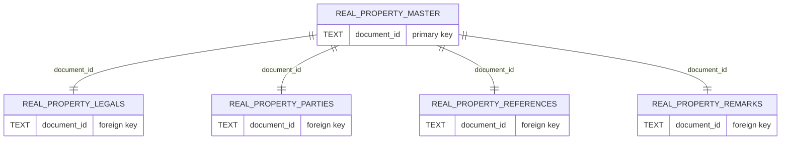

# Real Property Model

This module provides functionality for managing saved real property documents from the ACRIS (Automated City Register Information System) database. It handles the complete lifecycle of real property document data including creation, retrieval, updating, and deletion.

## Overview

The Real Property model manages complex relational data consisting of:

- **Master Record**: Core document information (document ID, type, amount, dates, etc.)
- **Legal Records**: Property location details (borough, block, lot, address)
- **Party Records**: Involved parties (buyers, sellers, lenders, etc.)
- **Reference Records**: Cross-references to other documents
- **Remark Records**: Additional notes and comments




## Functions

### `getSavedRealPropertyDocument(username, documentId = null)`

Retrieves saved real property documents for a specific user.

**Parameters:**

- `username` (string): The username of the document owner
- `documentId` (string, optional): Specific document ID to retrieve

**Returns:**

- If `documentId` provided: Single document object or `null` if not found
- If `documentId` omitted: Array of all documents for the user

**Example:**

```javascript
// Get all documents for a user
const allDocs = await getSavedRealPropertyDocument("john_doe");

// Get specific document
const doc = await getSavedRealPropertyDocument("john_doe", "2023123456789001");
```

### `saveRealPropertyDocument(username, docInput)`

Saves (inserts or updates) a complete real property document in a single transaction.

**Parameters:**

- `username` (string): The username of the document owner
- `docInput` (object): Document data with master, legals, parties, references, remarks

**Returns:**

- `masterId` (number): The database ID of the saved master record

**Features:**

- **Upsert Functionality**: Updates existing documents when same username/document_id combination exists
- **Data Sanitization**: Converts empty strings to `null` values for proper database storage
- **Transaction Safety**: Uses database transactions to ensure data consistency
- **Cascading Updates**: Clears and rebuilds all child records on updates

**Example:**

```javascript
const docData = {
  master: {
    document_id: "2023123456789001",
    record_type: "A",
    crfn: "2023000123001",
    recorded_borough: 1,
    doc_type: "DEED",
    document_date: "2023-12-15",
    document_amt: 500000.0,
    // ... other master fields
  },
  legals: [
    {
      /* legal record data */
    },
  ],
  parties: [
    {
      /* party record data */
    },
  ],
  references: [
    {
      /* reference record data */
    },
  ],
  remarks: [
    {
      /* remark record data */
    },
  ],
};

const masterId = await saveRealPropertyDocument("john_doe", docData);
```

### `deleteRealPropertyDocument(username, documentId)`

Deletes a saved real property document and all its related child records.

**Parameters:**

- `username` (string): The username of the document owner
- `documentId` (string): The document ID to delete

**Returns:**

- `masterId` (number): The database ID of the deleted master record, or `null` if not found

**Features:**

- **User Isolation**: Only deletes documents owned by the specified user
- **Cascading Deletes**: Automatically removes all related child records via database constraints

## Recent Changes (June 2025)

### 1. Enhanced Upsert Functionality

**Problem**: The original `ON CONFLICT` clause only updated the `modified_date` field, causing incomplete updates when documents were re-saved.

**Solution**: Updated the upsert query to properly update all master record fields:

```sql
ON CONFLICT (username, document_id) DO UPDATE SET
  record_type = EXCLUDED.record_type,
  crfn = EXCLUDED.crfn,
  recorded_borough = EXCLUDED.recorded_borough,
  doc_type = EXCLUDED.doc_type,
  document_date = EXCLUDED.document_date,
  document_amt = EXCLUDED.document_amt,
  recorded_datetime = EXCLUDED.recorded_datetime,
  modified_date = EXCLUDED.modified_date,
  reel_yr = EXCLUDED.reel_yr,
  reel_nbr = EXCLUDED.reel_nbr,
  reel_pg = EXCLUDED.reel_pg,
  percent_trans = EXCLUDED.percent_trans,
  good_through_date = EXCLUDED.good_through_date
```

**Impact**:

- Documents can now be properly updated with new values
- Tests for upsert functionality now pass
- Data integrity maintained across updates

### 2. Removed Debug Console Logging

**Problem**: The `batchInsert` helper function contained extensive `console.log` statements that cluttered test output and production logs.

**Solution**: Removed all debug logging statements while maintaining the core functionality.

**Impact**:

- Cleaner test output
- Improved performance (reduced I/O operations)
- Production-ready logging behavior

### 3. Clarified Empty Array Handling

**Behavior**: When `references` or `remarks` arrays are missing or empty, the model creates placeholder records with `null` values rather than skipping them entirely.

**Rationale**:

- Ensures consistent data structure
- Maintains referential integrity
- Simplifies client-side data handling

**Implementation**:

```javascript
// Creates empty record if array is empty
doc.references.length ? doc.references : [{}];
doc.remarks.length ? doc.remarks : [{}];
```

## Data Structure

### Master Record Fields

- `username`: Document owner
- `document_id`: Unique document identifier
- `record_type`: Record classification
- `crfn`: Control Reference Number
- `recorded_borough`: NYC borough code (1-5)
- `doc_type`: Document type (DEED, MTGE, etc.)
- `document_date`: Date of document
- `document_amt`: Transaction amount
- `recorded_datetime`: Recording timestamp
- `modified_date`: Last modification timestamp
- `reel_yr`, `reel_nbr`, `reel_pg`: Microfilm reference
- `percent_trans`: Percentage of transaction
- `good_through_date`: Data validity date

### Child Record Types

- **Legals**: Property location and type information
- **Parties**: People and entities involved in the transaction
- **References**: Links to related documents
- **Remarks**: Additional notes and comments

## Database Schema

The model uses the following tables:

- `saved_real_property_master` (main record)
- `saved_real_property_legals` (property details)
- `saved_real_property_parties` (involved parties)
- `saved_real_property_references` (document references)
- `saved_real_property_remarks` (additional notes)

All child tables have foreign key constraints with `ON DELETE CASCADE` to maintain referential integrity.

## Error Handling

The model includes comprehensive error handling:

- Database transaction rollback on errors
- User isolation validation
- Data constraint validation
- Graceful handling of missing or invalid data

## Testing

The model is fully tested with comprehensive test coverage including:

- CRUD operations
- User isolation
- Data sanitization
- Upsert functionality
- Error scenarios
- Edge cases (empty arrays, null values, etc.)

See `realProperty.test.js` for detailed test specifications.
