# SNACRIS sql, database and dataset notes

The following are notes associated with how the `snacris.sql` and related files in the `sql` folder were created, how they are organized and should be maintained as well as notes about how to seed the database.

## Datasets Overview

SNACRIS relies on data from 15 datasets hosted by the NYC Open Data API which is powered by Socrata.  These datasets can be divided into 3 groups: **Real Property**, **Personal Property** and **Code Mappings** (each referred to as a "dataset-group" or collectively as the "dataset-groups").  The **Code Mappings** dataset-group contains datasets that provide necessary data to query the other **Real Property** and **Personal Property** datasets.  The **Code Mappings** dataset-group contains the following datasets: **Document Type Codes**, **Property Type Codes**, **UCC Collateral Codes**, **USA State Codes** and **Country Codes**.  Note Well: the **UCC Collateral Codes** are only associated with the **Personal Property** dataset-group.  

The **Real Property** and **Personal Property** dataset-groups each follow the same schema of having the following dataset names: **Master**, **LEGALS**, **PARTIES**, **REFERENCES** and **REMARKS**.  Within each dataset-group each dataset can be cross-referenced with another dataset using the `document_id` field which represents a document that was recorded with the NYC Department of Finance such as a "deed" or "mortgage".  For example, the **Real Property - Master** dataset provides an overview of a document whereas the **Real Property - Legals** dataset provides geographical data associated with a document with unique `document_id`.  Furthermore, to extend this example in order for the user to find this document they would be given the search option of "DOCUMENT TYPE" from a select dropdown menu that contains all the values from the **Document Type Codes** dataset.  Since the **Document Type Codes** are used on the front-end and have not changed in years it is more efficient to seed the database and test database with these values.  This will reduce the number of API calls from my application.  I've included entity relational diagrams below for each dataset that contain the schema which I copied directly into my own `sql` schema files. 

### Dataset Index
Each dataset and its schema can be found below:
- [REAL_PROPERTY_MASTER](#real_property_master)
- [REAL_PROPERTY_LEGALS](#real_property_legals)
- [REAL_PROPERTY_PARTIES](#real_property_parties)
- [REAL_PROPERTY_REFERENCES](#real_property_references)
- [REAL_PROPERTY_REMARKS](#real_property_remarks)
- [PERSONAL_PROPERTY_MASTER](#real_property_master)
- [PERSONAL_PROPERTY_LEGALS](#real_property_legals)
- [PERSONAL_PROPERTY_PARTIES](#real_property_parties)
- [PERSONAL_PROPERTY_REFERENCES](#real_property_references)
- [PERSONAL_PROPERTY_REMARKS](#real_property_remarks)
- [DOCUMENT_TYPE_CODES](#document_type_codes)
- [UCC_COLLATERAL_CODES](#ucc_collateral_codes)
- [PROPERTY_TYPE_CODES](#property_type_codes)
- [STATE_CODES](#state_codes)
- [COUNTRY_CODES](#country_codes)

## Database Setup & SQL  

### `snacris.sql` Overview

The `snacris.sql` file is a comprehensive script designed to set up and initialize the `snacris` and `snacris_test` databases. This script is essential for preparing the database environment for the project, ensuring that both the main and test databases are correctly configured with the necessary schema and seed data.

#### Key Functions of `snacris.sql`

**1. Database Creation and Connection:**
- The script begins by prompting the user to confirm the deletion and recreation of the `snacris` database.
- It then drops the existing `snacris` database (if it exists) and creates a new one.
- The script connects to the newly created `snacris` database.

**2. Schema Setup:**
- The script includes several schema files to define the structure of the database tables and relationships:
  - `snacris-users-schema.sql`: Defines the schema for user-related tables.
  - `schema/snacris-acris-real-property-schema.sql`: Defines the schema for real property-related tables.
  - `schema/snacris-acris-personal-property-schema.sql`: Defines the schema for personal property-related tables.
  - `schema/snacris-acris-code-mappings-schema.sql`: Defines the schema for code mappings used in the project.

**3. Data Seeding:**
- After setting up the schema, the script seeds the database with initial data using several seed files:
  - `seed/snacris-seed-users.sql`: Seeds the users table with initial data.
  - `seed/snacris-seed-acris-document-control-codes.sql`: Seeds the document control codes table.
  - `seed/snacris-seed-acris-ucc-collateral-type-codes.sql`: Seeds the UCC collateral type codes table.
  - `seed/snacris-seed-acris-property-type-codes.sql`: Seeds the property type codes table.
  - `seed/snacris-seed-acris-usa-state-codes.sql`: Seeds the USA state codes table.
  - `seed/snacris-seed-acris-country-codes.sql`: Seeds the country codes table.

**4. Test Database Setup:**
- The script repeats the process for the `snacris_test` database, ensuring that a separate test environment is available.
- It drops the existing `snacris_test` database (if it exists) and creates a new one.
- The script connects to the newly created `snacris_test` database.
- It includes the same schema and seed files to set up the test database identically to the main database.

#### Folder Structure
- **Schema Files:** Located in the `schema` folder, these files define the structure of the database tables.
- **Seed Files:** Located in the `seed` folder, these files contain the initial data to populate the database tables.
- **Utility Files:** Located in the `utils` folder, these files include json files associated with the **Code Mapping** dataset-group and their `sql` equivalent.  
  
##### `convertJsonToSql.js` Overview

The `convertJsonToSql.js` file is a utility script designed to convert JSON data associated with the **Code Mapping** dataset-group into SQL insert statements. This script is particularly useful for preparing data to be inserted into a PostgreSQL database.

**Purpose** 

The primary purpose of this script is to read JSON files containing ACRIS data, convert the data into SQL `INSERT` statements, and write the resulting SQL to an output file. This allows for easy and automated population of database tables with the provided data.

**Supported JSON Files:**
- Document Control Codes
- Property Type Codes
- UCC Collateral Codes
- USA State Codes
- Country Codes

**How to Execute the Script**

To run the script, use the following command in the terminal:

```bash
node convertJsonToSql.js <inputJsonFile> <outputSqlFile>
```

For example:
```bash
node convertJsonToSql.js acris-doc-control-codes.json acris-doc-control-codes-output.sql
node convertJsonToSql.js acris-property-type-codes.json acris-property-type-codes-output.sql
node convertJsonToSql.js acris-ucc-collateral-codes.json acris-ucc-collateral-codes-output.sql
node convertJsonToSql.js acris-usa-state-codes.json acris-usa-state-codes-output.sql
node convertJsonToSql.js acris-country-codes.json acris-country-codes-output.sql
```

Any `sql` file created from running the script will appear in the `utils` folder and replace any `sql` file with the same name.  For example, running the command `node convertJsonToSql.js acris-doc-control-codes.json acris-doc-control-codes-output.sql` will overwrite an existing file named `acris-doc-control-codes-output.sql`.  If such a file does not exist it will create it. 

### Database Setup Instructions 

- Create the **snacris** database using the `snacris.sql` file.

1. To set up the databases using the `snacris.sql` file, follow these steps:

- Open your terminal in Visual Studio Code (VSC) using WSL/Ubuntu.
- Ensure you have PostgreSQL installed and running. You can start PostgreSQL with the following command:

```bash
sudo service postgresql start
```

- Navigate to the directory containing the `snacris.sql file`. For example:

```bash
cd path/to/your/project
```

- Run the `snacris.sql` file using the `psql` command-line tool. This will execute the SQL commands in the file to set up your databases:

```
psql -U your_username -f snacris.sql
```

Remember to Replace `your_username` with your PostgreSQL username. You may be prompted to enter your password.

Follow the prompts in the terminal. Press Enter to proceed with deleting and recreating the databases or Control-C to cancel.

- After completing these steps, you should have both the **snacris** and **snacris_test** databases set up with the necessary schema and initial data.

### REAL_PROPERTY_MASTER
#### NYC Open Data URL: http://data.cityofnewyork.us/City-Government/ACRIS-Real-Property-Master/bnx9-e6tj
#### NYS OPEN DATA Name: ACRIS - Real Property Master
#### NYS OPEN DATA Description: Document Details for Real Property Related Documents Recorded in ACRIS
#### API Endpoint URL: https://data.cityofnewyork.us/resource/bnx9-e6tj.json

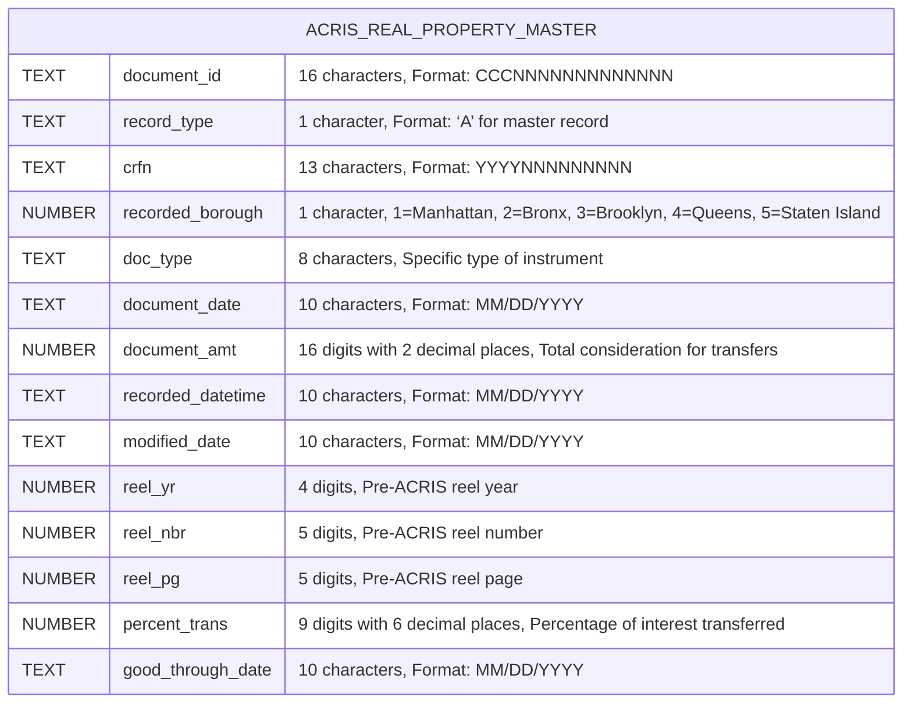

[BACK TO TOC](#dataset-index)

---

### REAL_PROPERTY_LEGALS
#### NYC Open Data URL: https://data.cityofnewyork.us/City-Government/ACRIS-Real-Property-Legals/8h5j-fqxa/about_data
#### NYS OPEN DATA Name: ACRIS - Real Property Legals
#### NYS OPEN DATA Description: Property Details for Real Property Related Documents Recorded in ACRIS
#### API Endpoint URL: https://data.cityofnewyork.us/resource/8h5j-fqxa.json

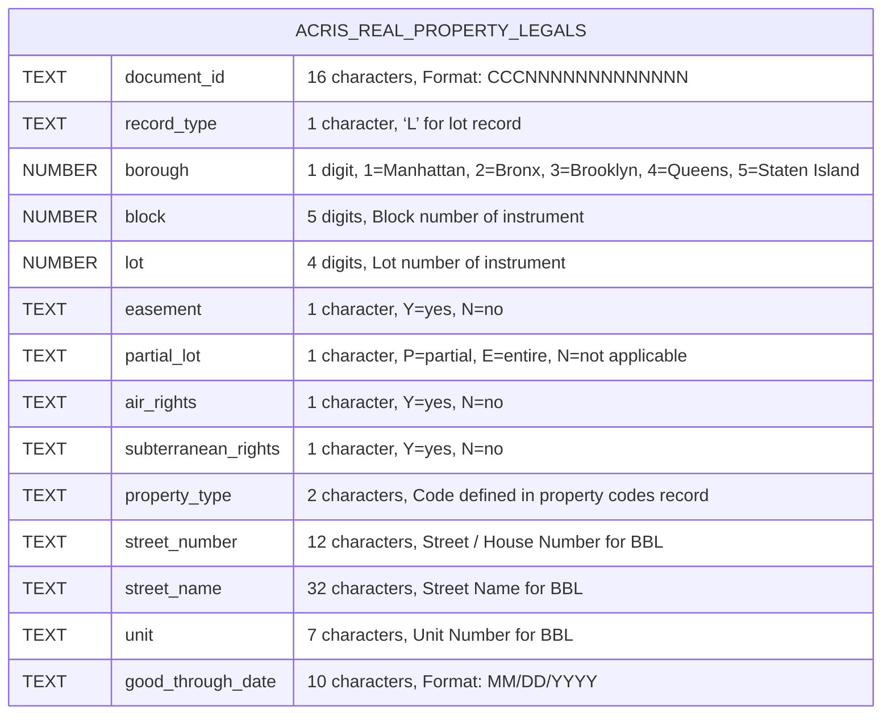

[BACK TO TOC](#dataset-index)

---

### REAL_PROPERTY_PARTIES

#### NYC Open Data URL: https://data.cityofnewyork.us/City-Government/ACRIS-Real-Property-Parties/636b-3b5g/about_data
#### NYS OPEN DATA Name: ACRIS - Real Property Parties
#### NYS OPEN DATA Description: Party Names for Real Property Related Documents Recorded in ACRIS
#### API Endpoint URL: https://data.cityofnewyork.us/resource/636b-3b5g.json

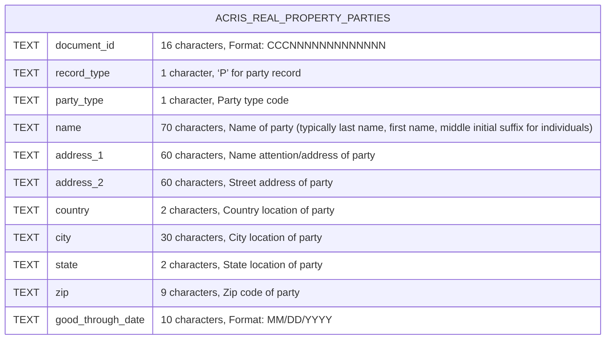
[BACK TO TOC](#dataset-index)
---

### REAL_PROPERTY_REFERENCES
#### NYC Open Data URL: https://data.cityofnewyork.us/City-Government/ACRIS-Real-Property-References/pwkr-dpni/about_data
#### NYS OPEN DATA Name: ACRIS - Real Property References
#### NYS OPEN DATA Description: Document Cross References for Real Property Related Documents Recorded in ACRIS
#### API Endpoint URL: https://data.cityofnewyork.us/resource/pwkr-dpni.json

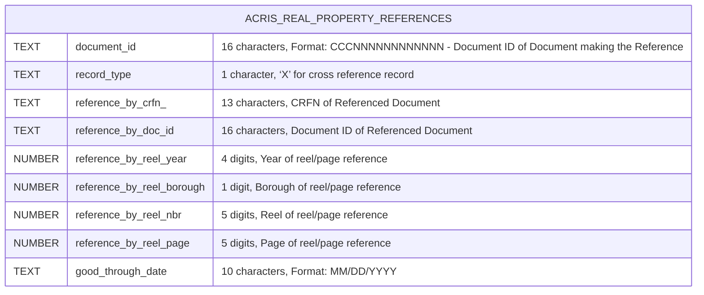
[BACK TO TOC](#dataset-index)
---

### REAL_PROPERTY_REMARKS
#### NYC Open Data URL: https://data.cityofnewyork.us/City-Government/ACRIS-Real-Property-Remarks/9p4w-7npp/about_data
#### NYS OPEN DATA Name: ACRIS - Real Property Remarks
#### NYS OPEN DATA Description: Document Remarks for Real Property Related Documents Recorded in ACRIS
#### API Endpoint URL: https://data.cityofnewyork.us/resource/9p4w-7npp.json

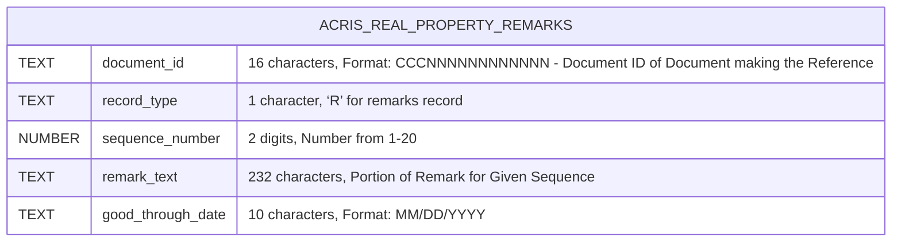
[BACK TO TOC](#dataset-index)
---

### PERSONAL_PROPERTY_MASTER
#### NYC Open Data URL: https://data.cityofnewyork.us/City-Government/ACRIS-Personal-Property-Master/sv7x-dduq/about_data
#### NYS OPEN DATA Name: ACRIS - Personal Property Master
#### NYS OPEN DATA Description: Document Details for Personal Property Related Documents Recorded in ACRIS
#### API Endpoint URL: https://data.cityofnewyork.us/resource/sv7x-dduq.json

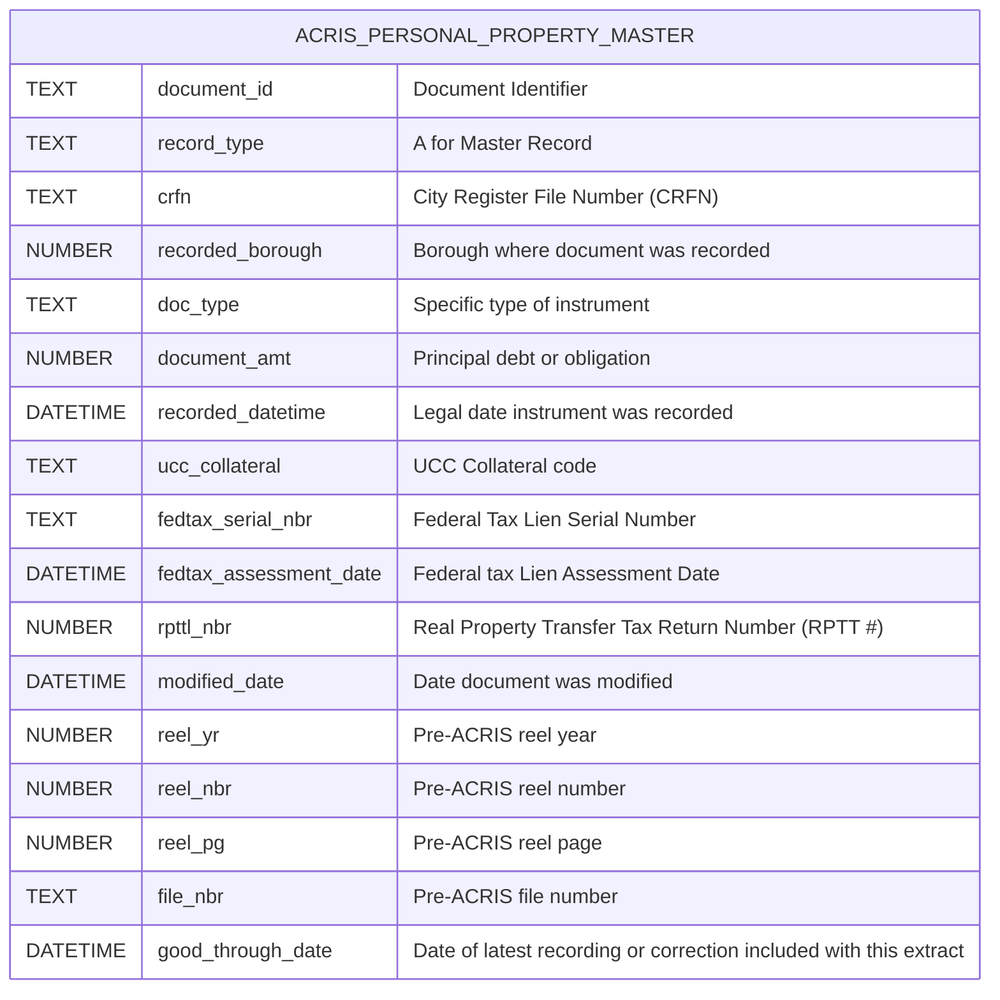
[BACK TO TOC](#dataset-index)
---

### PERSONAL_PROPERTY_LEGALS
#### NYC Open Data URL: https://data.cityofnewyork.us/City-Government/ACRIS-Personal-Property-Legals/uqqa-hym2/about_data
#### NYS OPEN DATA Name: ACRIS - Personal Property Legals
#### NYS OPEN DATA Description: Property Details for Personal Property Related Documents Recorded in ACRIS
#### API Endpoint URL: https://data.cityofnewyork.us/resource/uqqa-hym2.json

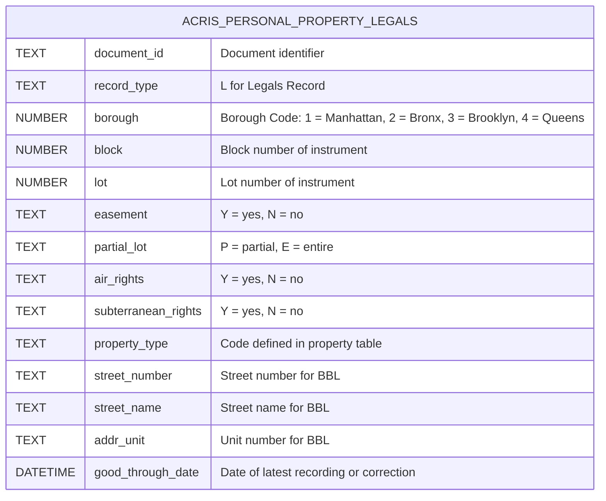
[BACK TO TOC](#dataset-index)
---

### PERSONAL_PROPERTY_PARTIES
#### NYC Open Data URL: https://data.cityofnewyork.us/City-Government/ACRIS-Personal-Property-Parties/nbbg-wtuz/about_data
#### NYS OPEN DATA Name: ACRIS - Personal Property Parties
#### NYS OPEN DATA Description: Party Names for Personal Property Related Documents Recorded in ACRIS
#### API Endpoint URL: https://data.cityofnewyork.us/resource/nbbg-wtuz.json

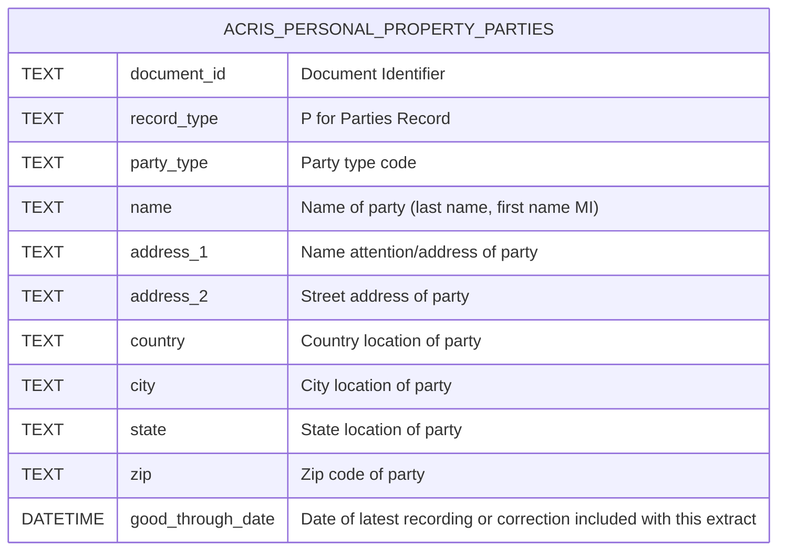
[BACK TO TOC](#dataset-index)
---

### PERSONAL_PROPERTY_REFERENCES
#### NYC Open Data URL: https://data.cityofnewyork.us/City-Government/ACRIS-Personal-Property-References/6y3e-jcrc/about_data
#### NYS OPEN DATA Name: ACRIS - Personal Property References
#### NYS OPEN DATA Description: Document Remarks for Personal Property Related Documents Recorded in ACRIS
#### API Endpoint URL: https://data.cityofnewyork.us/resource/6y3e-jcrc.json

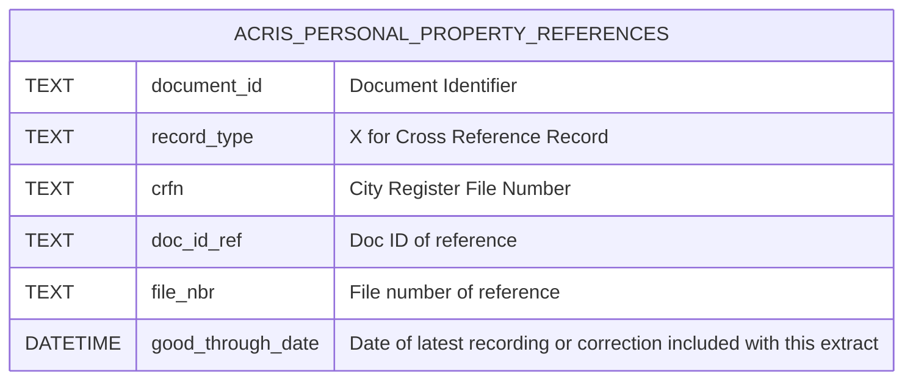
[BACK TO TOC](#dataset-index)
---

### PERSONAL_PROPERTY_REMARKS
#### NYC Open Data URL: https://data.cityofnewyork.us/City-Government/ACRIS-Personal-Property-Remarks/fuzi-5ks9/about_data
#### NYS OPEN DATA Name: ACRIS - Personal Property Remarks
#### NYS OPEN DATA Description: Document Remarks for Personal Property Related Documents Recorded in ACRIS
#### API Endpoint URL: https://data.cityofnewyork.us/resource/fuzi-5ks9.json

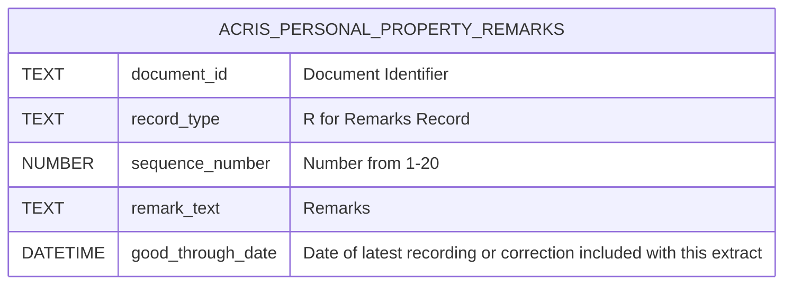
[BACK TO TOC](#dataset-index)
---

### DOCUMENT_TYPE_CODES
#### NYC Open Data URL: https://data.cityofnewyork.us/City-Government/ACRIS-Document-Control-Codes/7isb-wh4c/about_data
#### NYS OPEN DATA Name: ACRIS - Document Control Codes
#### NYS OPEN DATA Description: ACRIS Document Type and Class Code mappings for Codes in the ACRIS Real and Personal Property Master Datasets
#### API Endpoint URL: https://data.cityofnewyork.us/resource/7isb-wh4c.json

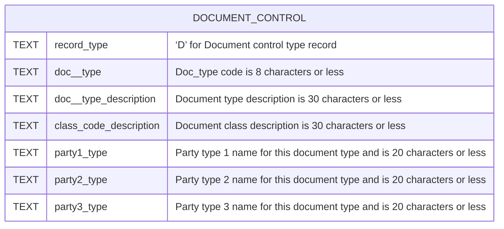
[BACK TO TOC](#dataset-index)
---

### UCC_COLLATERAL_CODES
#### NYC Open Data URL: https://data.cityofnewyork.us/City-Government/ACRIS-UCC-Collateral-Codes/q9kp-jvxv/about_data
#### NYS OPEN DATA Name: ACRIS - UCC Collateral Codes
#### NYS OPEN DATA Description: ACRIS Collateral Type mapping for Codes in the ACRIS Personal Property Master Dataset
#### API Endpoint URL: https://data.cityofnewyork.us/resource/q9kp-jvxv.json
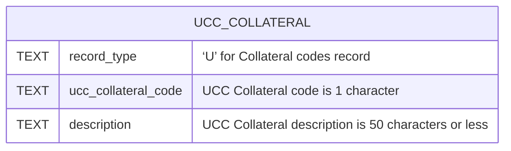
[BACK TO TOC](#dataset-index)
---

### PROPERTY_TYPE_CODES
#### NYC Open Data URL: https://data.cityofnewyork.us/City-Government/ACRIS-Property-Types-Codes/94g4-w6xz/about_data
#### NYS OPEN DATA Name: ACRIS - Property Types Codes
#### NYS OPEN DATA Description: ACRIS State mapping for Codes in the ACRIS Real and Personal Property Legals Datasets
#### API Endpoint URL: https://data.cityofnewyork.us/resource/94g4-w6xz.json
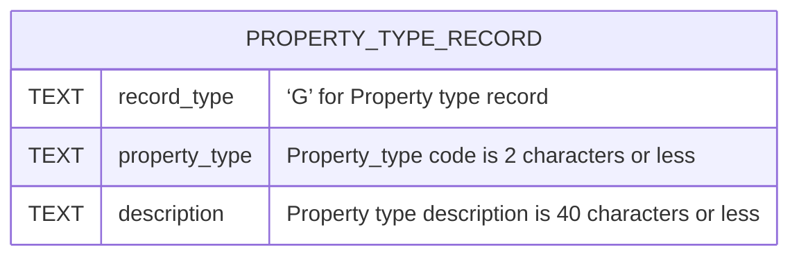
[BACK TO TOC](#dataset-index)
---

### STATE_CODES
#### NYC Open Data URL: https://data.cityofnewyork.us/City-Government/ACRIS-State-Codes/5c9e-33xj/about_data
#### NYS OPEN DATA Name: ACRIS - State Codes
#### NYS OPEN DATA Description: ACRIS State mapping for Codes in the ACRIS Real and Personal Parties Property Datasets
#### API Endpoint URL: https://data.cityofnewyork.us/resource/5c9e-33xj.json
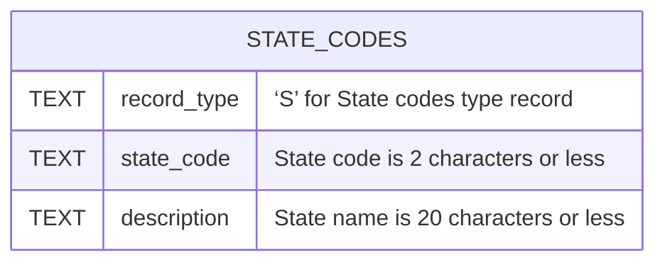
[BACK TO TOC](#dataset-index)
---

### COUNTRY_CODES
#### NYC Open Data URL: https://data.cityofnewyork.us/City-Government/ACRIS-Country-Codes/j2iz-mwzu/about_data
#### NYS OPEN DATA Name: ACRIS - Country Codes
#### NYS OPEN DATA Description: ACRIS Countries mapping for Codes in the ACRIS Real and Personal Parties Property Datasets
#### API Endpoint URL: https://data.cityofnewyork.us/resource/j2iz-mwzu.json
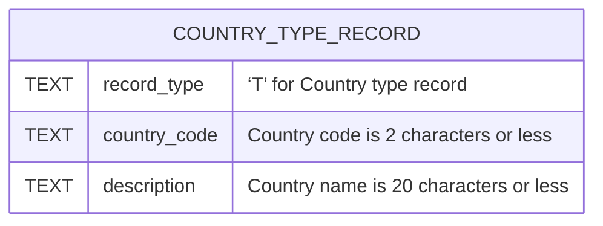
[BACK TO TOC](#dataset-index)