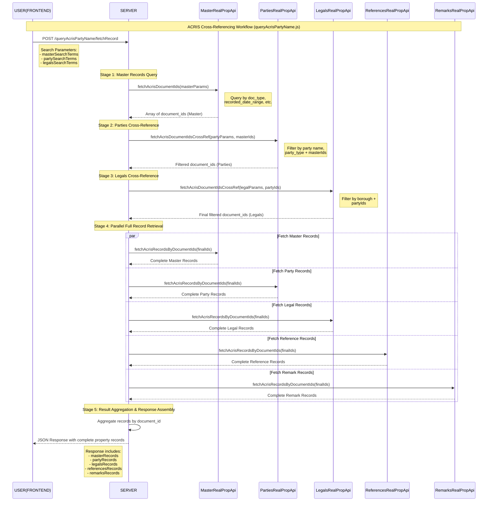

# Socrata & ACRIS API Notes

This is a notepad for Socrata's simple filter and more complex SoQL Queries and the ACRIS datasets.

## Socrata APIs - filters versus SoQL queries

### Simple Filters

#### Advantages:

1. **Ease of Use:** Simple filters are straightforward and easy to use. You can directly append them to the URL as query parameters.
2. **Readability:** The resulting URL is often more readable and easier to understand.
3. **Basic Filtering:** Ideal for basic equality comparisons and straightforward filtering.

#### Limitations:

1. **Limited Functionality:** Simple filters are limited to basic equality comparisons and cannot handle complex queries.
2. **No Aggregation:** You cannot perform aggregations, grouping, or ordering with simple filters.

#### Example:

```
https://data.cityofnewyork.us/resource/bnx9-e6tj.json?document_id=2024061800496001&record_type=A
```

### SoQL Queries

#### Advantages:

1. **Advanced Querying:** SoQL supports advanced querying capabilities similar to SQL, including `SELECT`, `WHERE`, `ORDER BY`, `GROUP BY`, `HAVING`, and more.
2. **Aggregations and Functions:** You can perform aggregations (e.g., `SUM`, `AVG`, `COUNT`) and use various functions (e.g., `date_extract_y`, `max`, `min`).
3. **Complex Filtering:** Allows for complex filtering conditions, including logical operators (`AND`, `OR`), range queries (`BETWEEN`), and pattern matching (`LIKE`).

#### Limitations:

1. **Complexity:** SoQL queries can be more complex to construct and understand, especially for users unfamiliar with SQL-like syntax.
2. **URL Length:** Complex queries can result in long URLs, which might be harder to manage and debug.

Example:

```
https://data.cityofnewyork.us/resource/bnx9-e6tj.json?$where=document_id='2024061800496001' AND record_type='A'
```

### Comparison

1. Simple Filters are best for straightforward, basic filtering where you only need to match specific field values.
2. SoQL Queries are more powerful and flexible, allowing for complex querying, aggregations, and advanced filtering.

### What you cannot do with Simple Filters

1. Perform aggregations (e.g., `SUM`, `AVG`, `COUNT`).
2. Use advanced functions (e.g., `date_extract_y`, `max`, `min`).
3. Apply complex logical conditions (e.g., combining multiple conditions with `AND`/`OR`).
4. Order or group results.

### What You Cannot Do with SoQL Queries

1. SoQL queries can handle everything that simple filters can, but they require more complex syntax and understanding of the SoQL language.

## ThirdPartyApi Folder Structure

The `thirdPartyApi/` directory contains all external API integration modules, primarily focused on NYC's ACRIS (Automated City Register Information System) and Socrata API interactions. This folder is organized to handle different types of property records and code mappings from the ACRIS system.

### Root Level Files

- **`apiEndpoints.js`** - Central configuration file containing all ACRIS API endpoint URLs and constants
- **`utils.js`** - Common utility functions for API interactions, data processing, and error handling
- **`README.MD`** - Documentation for Socrata API usage patterns and SoQL query examples

### ACRIS API Modules (`acris/`)

The ACRIS directory contains specialized API modules for different aspects of NYC property records:

#### Code Maps (`acris/code-maps/`)

API modules for fetching reference data and code mappings:

- **`CountriesCodeMapApi.js`** - Fetch country code mappings from ACRIS
- **`DocTypesCodeMapApi.js`** - Fetch document type codes and descriptions
- **`PropTypesCodeMapApi.js`** - Fetch property type codes and classifications
- **`StatesCodeMapApi.js`** - Fetch state/territory codes
- **`UccTypesCodeMapApi.js`** - Fetch UCC (Uniform Commercial Code) type mappings

#### Personal Property (`acris/personal-property/`)

API modules for UCC (personal property) records:

- **`LegalsPersPropApi.js`** - Fetch legal descriptions for personal property records
- **`MasterPersPropApi.js`** - Main personal property record API (primary record data)
- **`PartiesPersPropApi.js`** - Fetch parties involved in personal property transactions
- **`ReferencesPersPropApi.js`** - Fetch cross-references for personal property records
- **`RemarksPersPropApi.js`** - Fetch remarks and comments for personal property records

#### Real Property (`acris/real-property/`)

API modules for real estate property records:

- **`LegalsRealPropApi.js`** - Fetch legal descriptions for real property records
- **`MasterRealPropApi.js`** - Main real property record API (deeds, mortgages, etc.)
- **`PartiesRealPropApi.js`** - Fetch parties involved in real property transactions
- **`ReferencesRealPropApi.js`** - Fetch cross-references for real property records
- **`RemarksRealPropApi.js`** - Fetch remarks and comments for real property records
- Corresponding `.test.js` files for comprehensive API testing

#### Utilities (`acris/utils/`)

Specialized utility functions for ACRIS API operations:

- **`CreateUrlBatchesArray.js`** - Create batched URL arrays for bulk API requests to handle rate limiting
- **`SoqlUrl.js`** - Construct SoQL (Socrata Query Language) URLs with proper encoding and parameters
- **`SoqlUrl.test.js`** - Unit tests for SoQL URL construction

## API Architecture Patterns

## Cross Referencing Result Data via GET Requests to ACRIS APIs

The ACRIS API cross-referencing system implements a sophisticated multi-stage querying pattern that enables complex property record searches by chaining API calls through shared `document_id` values. This approach allows the system to narrow down search results progressively, combining criteria from multiple ACRIS datasets to arrive at precise, targeted results that meet all specified search parameters.

The cross-referencing process follows a sequential filtering methodology where each API call uses the `document_id` results from the previous call as input parameters, effectively creating an intersection of records that satisfy all search criteria. This pattern is essential because ACRIS data is distributed across multiple specialized datasets (Master, Parties, Legals, References, and Remarks), and each dataset contains different types of information that must be correlated through the shared `document_id` field.

## `queryAcrisPartyName.js`



### Implementation Example: Party Name Search (`queryAcrisPartyName.js`)

The `queryAcrisPartyName.js` route demonstrates the complete cross-referencing workflow through a five-stage process that progressively narrows search results:

**Stage 1: Master Records Query** - The process begins by querying the Master Real Property API (`MasterRealPropApi.fetchAcrisDocumentIds()`) using master search parameters such as document type, document class, and recorded date ranges. This initial query establishes the universe of property transactions that match the basic criteria and returns an array of `document_id` values representing eligible transactions.

**Stage 2: Parties Cross-Reference** - The system then queries the Parties Real Property API (`PartiesRealPropApi.fetchAcrisDocumentIdsCrossRef()`) using both the party search parameters (such as party name and party type) and the `document_id` array from Stage 1. This cross-reference operation identifies which of the Master records also contain parties that match the specified criteria, returning a refined array of `document_id` values that satisfy both Master and Parties conditions.

**Stage 3: Legals Cross-Reference** - Next, the Legals Real Property API (`LegalsRealPropApi.fetchAcrisDocumentIdsCrossRef()`) is queried using the legal search parameters (such as borough specifications) and the `document_id` array from Stage 2. This further narrows the results to include only those transactions that also meet the legal/geographical criteria, producing a final filtered array of `document_id` values.

**Stage 4: Parallel Full Record Retrieval** - With the final filtered `document_id` array established, the system performs parallel API calls to all five ACRIS datasets (`MasterRealPropApi.fetchAcrisRecordsByDocumentIds()`, `PartiesRealPropApi.fetchAcrisRecordsByDocumentIds()`, `LegalsRealPropApi.fetchAcrisRecordsByDocumentIds()`, `ReferencesRealPropApi.fetchAcrisRecordsByDocumentIds()`, and `RemarksRealPropApi.fetchAcrisRecordsByDocumentIds()`) to retrieve complete record details for each `document_id` in the final result set.

**Stage 5: Result Aggregation and Response Assembly** - Finally, the system aggregates all retrieved records by `document_id`, creating a comprehensive response object that includes master records, party records, legal records, reference records, and remark records for each qualifying transaction, organized in a structured format that facilitates client-side data consumption and display.

### Key Technical Features:

- **Progressive Filtering**: Each stage reduces the result set by applying additional criteria, ensuring only records meeting all conditions are included
- **Batch Processing**: The `fetchAcrisDocumentIdsCrossRef()` methods use URL batching (`SoqlUrl.constructUrlBatches()`) to handle large `document_id` arrays efficiently while respecting API rate limits
- **Error Isolation**: Each stage captures and handles errors independently, allowing partial success scenarios and providing detailed error reporting for troubleshooting
- **Parallel Optimization**: The final record retrieval stage uses `Promise.allSettled()` to fetch complete records from all datasets simultaneously, minimizing total query time
- **Data Deduplication**: The cross-reference methods use `Set` data structures to automatically eliminate duplicate `document_id` values during processing

### Data Flow

1. **Code Maps** - Reference data for interpreting record codes
2. **Master Records** - Primary property transaction data
3. **Related Records** - Parties, legals, references, and remarks linked to master records

### Testing Strategy

- Unit tests for URL construction and data transformation
- Integration tests for actual API calls (where applicable)
- Simple tests for basic functionality validation

### Batch Processing

- API modules support batch processing for large data requests
- Rate limiting considerations built into utility functions
- Error handling for network timeouts and API limits

## File Naming Conventions

- **API Modules**: `DescriptiveNameApi.js`
- **Test Files**: `ModuleName.test.js` or `ModuleName.simple.test.js`
- **Utilities**: `CamelCaseUtility.js`
- **README files**: Present in each subdirectory with domain-specific API documentation
