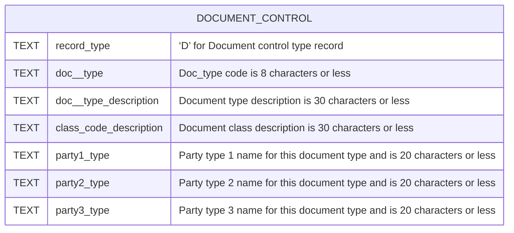
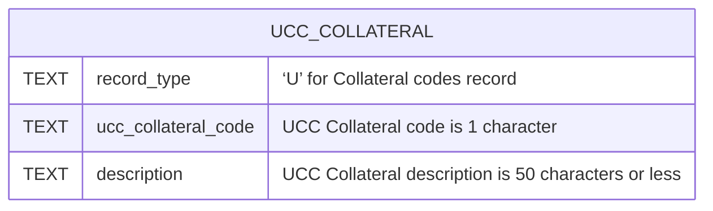
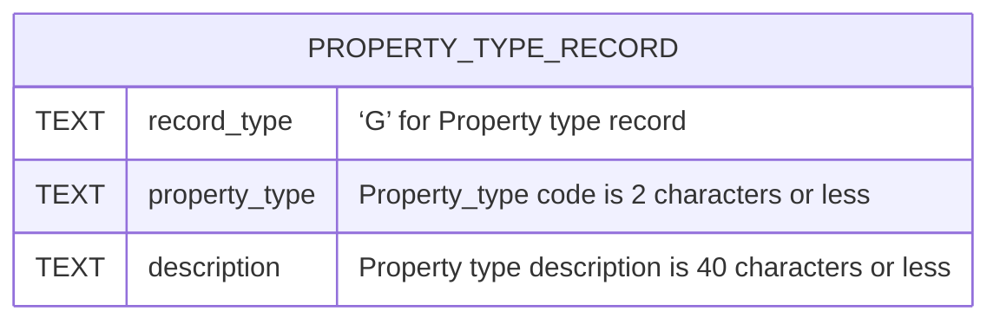
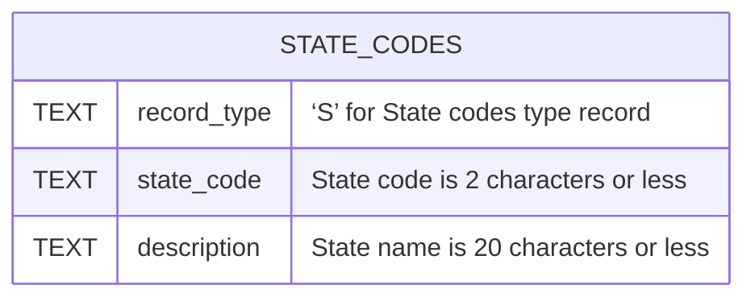
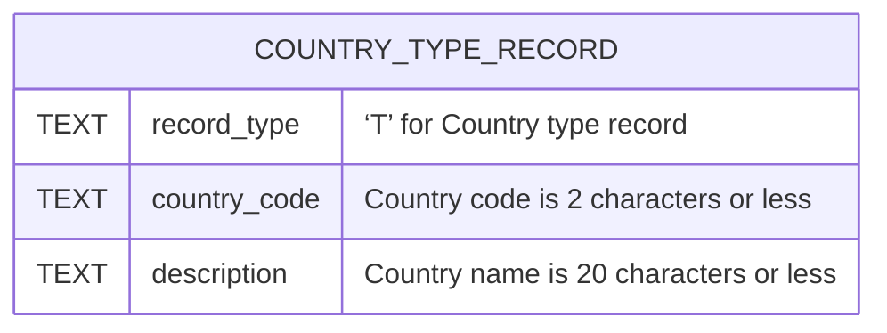

# CODE MAPS OF ACRIS DATASET API NOTES

The Code Maps APIs provide data that is used to query the ACRIS-Real Property and ACRIS-Personal Property datasets.  Each of the datasets below has been downloaded and seeded into the SNACRIS and SNACRIS_TEST databases.  The purpose of making GET requests to these five APIs is to regularly check that each dataset has not been changed or updated.  The goal of this `code-mappings` folder is to create tests that test not just the success of making a GET request but to compare the API response object against the following psql tables which are located in the `sql` > `schema` folder: `document_control_codes`, `ucc_collateral_codes`, `property_type_codes`, `state_codes` and `country_codes`.

### DOCUMENT_TYPE_CODES
#### NYC Open Data URL: https://data.cityofnewyork.us/City-Government/ACRIS-Document-Control-Codes/7isb-wh4c/about_data
#### NYS OPEN DATA Name: ACRIS - Document Control Codes
#### NYS OPEN DATA Description: ACRIS Document Type and Class Code mappings for Codes in the ACRIS Real and Personal Property Master Datasets
#### API Endpoint URL: https://data.cityofnewyork.us/resource/7isb-wh4c.json

[BACK TO TOC](#dataset-index)
---

### UCC_COLLATERAL_CODES
#### NYC Open Data URL: https://data.cityofnewyork.us/City-Government/ACRIS-UCC-Collateral-Codes/q9kp-jvxv/about_data
#### NYS OPEN DATA Name: ACRIS - UCC Collateral Codes
#### NYS OPEN DATA Description: ACRIS Collateral Type mapping for Codes in the ACRIS Personal Property Master Dataset
#### API Endpoint URL: https://data.cityofnewyork.us/resource/q9kp-jvxv.json

[BACK TO TOC](#dataset-index)
---

### PROPERTY_TYPE_CODES
#### NYC Open Data URL: https://data.cityofnewyork.us/City-Government/ACRIS-Property-Types-Codes/94g4-w6xz/about_data
#### NYS OPEN DATA Name: ACRIS - Property Types Codes
#### NYS OPEN DATA Description: ACRIS State mapping for Codes in the ACRIS Real and Personal Property Legals Datasets
#### API Endpoint URL: https://data.cityofnewyork.us/resource/94g4-w6xz.json

[BACK TO TOC](#dataset-index)
---

### STATE_CODES
#### NYC Open Data URL: https://data.cityofnewyork.us/City-Government/ACRIS-State-Codes/5c9e-33xj/about_data
#### NYS OPEN DATA Name: ACRIS - State Codes
#### NYS OPEN DATA Description: ACRIS State mapping for Codes in the ACRIS Real and Personal Parties Property Datasets
#### API Endpoint URL: https://data.cityofnewyork.us/resource/5c9e-33xj.json

[BACK TO TOC](#dataset-index)
---

### COUNTRY_CODES
#### NYC Open Data URL: https://data.cityofnewyork.us/City-Government/ACRIS-Country-Codes/j2iz-mwzu/about_data
#### NYS OPEN DATA Name: ACRIS - Country Codes
#### NYS OPEN DATA Description: ACRIS Countries mapping for Codes in the ACRIS Real and Personal Parties Property Datasets
#### API Endpoint URL: https://data.cityofnewyork.us/resource/j2iz-mwzu.json

[BACK TO TOC](#dataset-index)