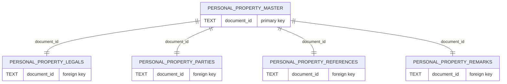
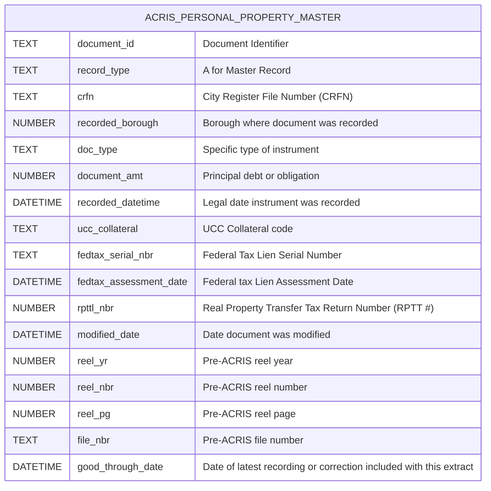
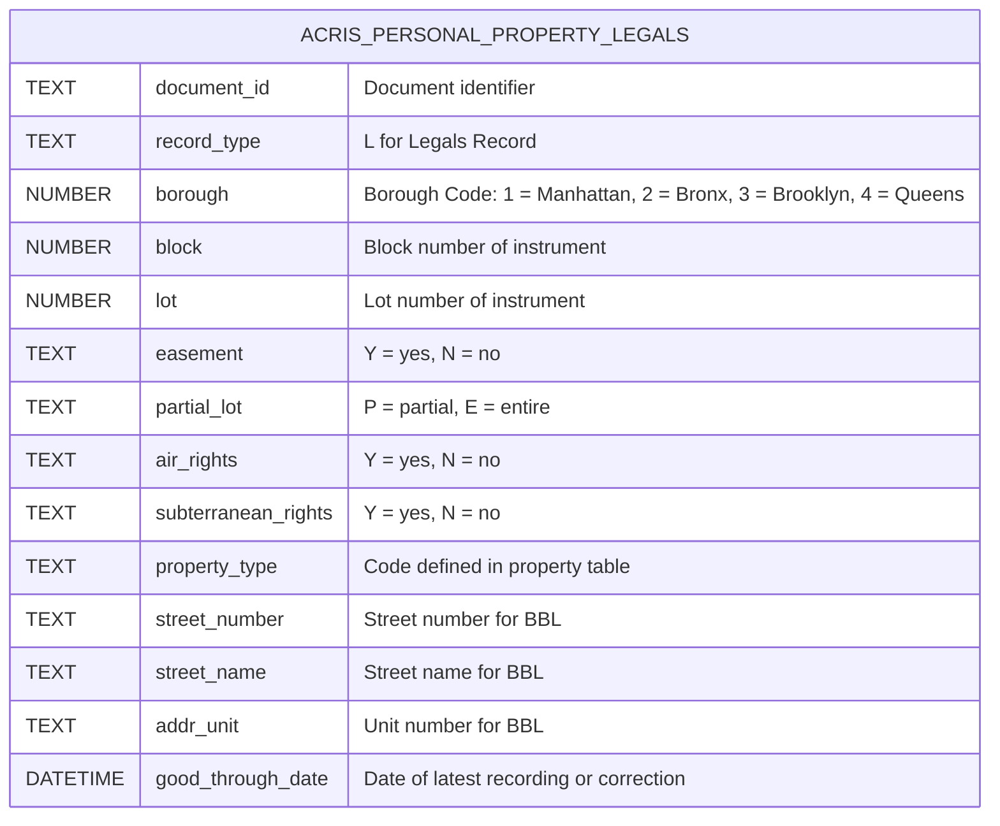
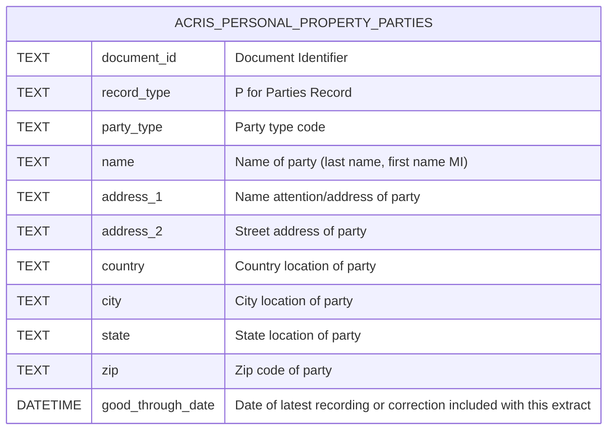
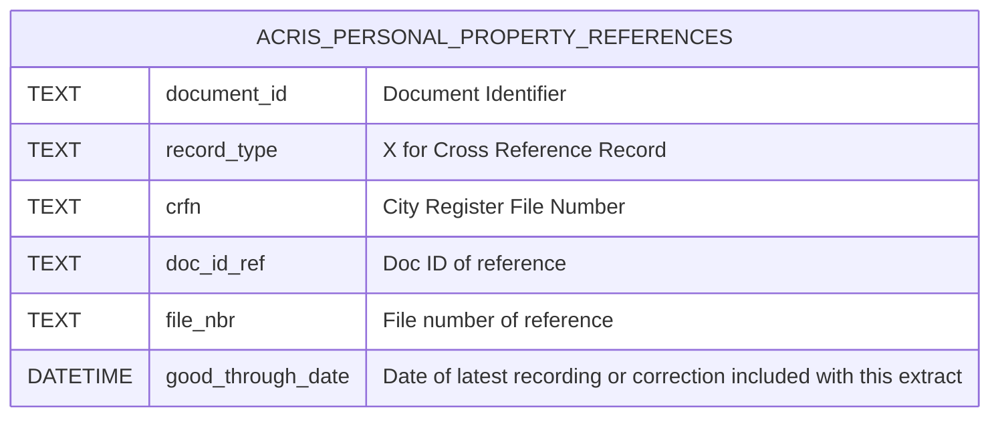
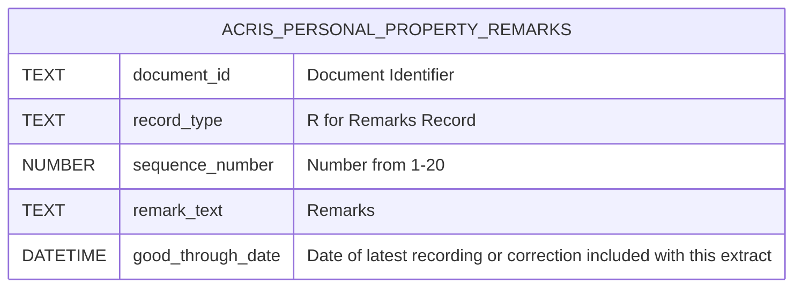

# ACRIS PERSONAL PROPERTY DATASET API 

## Table of Contents

- [Personal Property (Overview)](#personal-property-overview)
    - [PERSONAL_PROPERTY_MASTER](#personal_property_master)
    - [PERSONAL_PROPERTY_LEGALS](#personal_property_legals)
    - [PERSONAL_PROPERTY_PARTIES](#personal_property_parties)
    - [PERSONAL_PROPERTY_REFERENCES](#personal_property_references)
    - [PERSONAL_PROPERTY_REMARKS](#personal_property_remarks)

## Personal Property (Overview)

### PERSONAL_PROPERTY_MASTER
#### NYC Open Data URL: https://data.cityofnewyork.us/City-Government/ACRIS-Personal-Property-Master/sv7x-dduq/about_data
#### NYS OPEN DATA Name: ACRIS - Personal Property Master
#### NYS OPEN DATA Description: Document Details for Personal Property Related Documents Recorded in ACRIS
#### API Endpoint URL: https://data.cityofnewyork.us/resource/sv7x-dduq.json

---

### PERSONAL_PROPERTY_LEGALS
#### NYC Open Data URL: https://data.cityofnewyork.us/City-Government/ACRIS-Personal-Property-Legals/uqqa-hym2/about_data
#### NYS OPEN DATA Name: ACRIS - Personal Property Legals
#### NYS OPEN DATA Description: Property Details for Personal Property Related Documents Recorded in ACRIS
#### API Endpoint URL: https://data.cityofnewyork.us/resource/uqqa-hym2.json

---

### PERSONAL_PROPERTY_PARTIES
#### NYC Open Data URL: https://data.cityofnewyork.us/City-Government/ACRIS-Personal-Property-Parties/nbbg-wtuz/about_data
#### NYS OPEN DATA Name: ACRIS - Personal Property Parties
#### NYS OPEN DATA Description: Party Names for Personal Property Related Documents Recorded in ACRIS
#### API Endpoint URL: https://data.cityofnewyork.us/resource/nbbg-wtuz.json

---

### PERSONAL_PROPERTY_REFERENCES
#### NYC Open Data URL: https://data.cityofnewyork.us/City-Government/ACRIS-Personal-Property-References/6y3e-jcrc/about_data
#### NYS OPEN DATA Name: ACRIS - Personal Property References
#### NYS OPEN DATA Description: Document Remarks for Personal Property Related Documents Recorded in ACRIS
#### API Endpoint URL: https://data.cityofnewyork.us/resource/6y3e-jcrc.json

---

### PERSONAL_PROPERTY_REMARKS
#### NYC Open Data URL: https://data.cityofnewyork.us/City-Government/ACRIS-Personal-Property-Remarks/fuzi-5ks9/about_data
#### NYS OPEN DATA Name: ACRIS - Personal Property Remarks
#### NYS OPEN DATA Description: Document Remarks for Personal Property Related Documents Recorded in ACRIS
#### API Endpoint URL: https://data.cityofnewyork.us/resource/fuzi-5ks9.json

