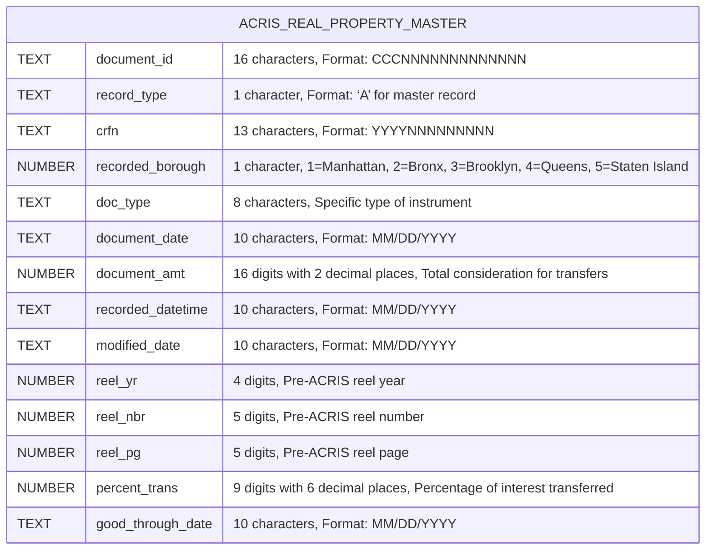
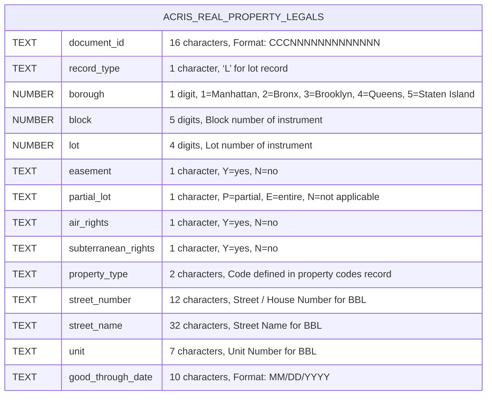
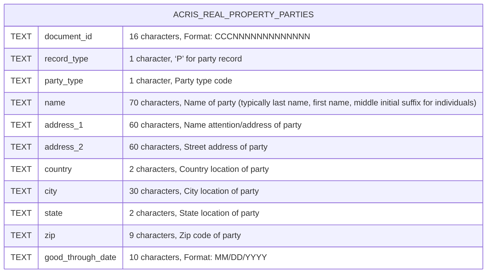
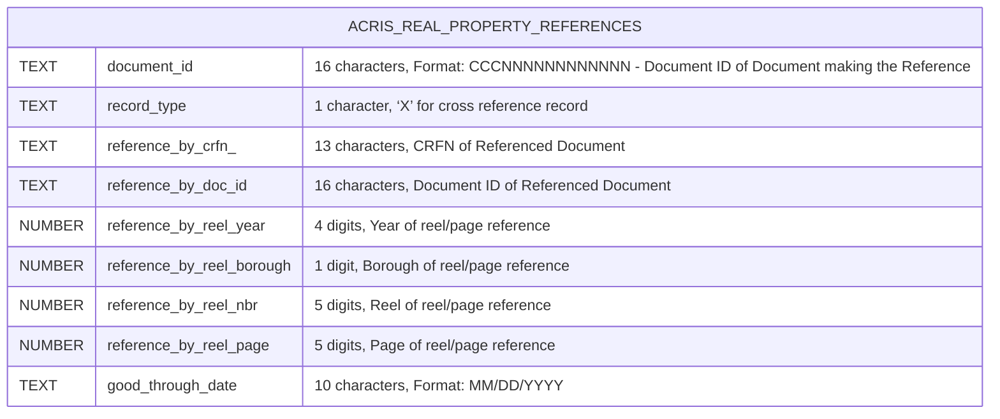
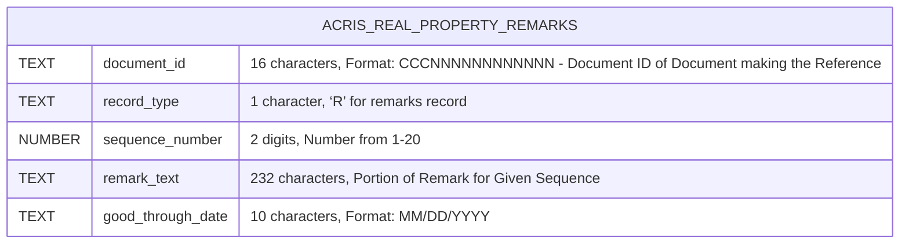

# REAL PROPERTY API NOTES

## Table of Contents

- [REAL PROPERTY API NOTES](#real-property-api-notes)
  - [Table of Contents](#table-of-contents)
  - [API File Architecture](#api-file-architecture)
    - [`fetchAcrisRecords`](#fetchacrisrecords)
      - [Purpose](#purpose)
      - [How It Works](#how-it-works)
      - [Pagination Logic](#pagination-logic)
      - [Examples](#examples)
      - [Behavior](#behavior)
    - [`fetchAcrisRecordCount`](#fetchacrisrecordcount)
      - [Purpose](#purpose-1)
      - [How It Works](#how-it-works-1)
      - [Examples](#examples-1)
      - [Behavior](#behavior-1)
    - [`fetchAcrisDocumentIds`](#fetchacrisdocumentids)
      - [Purpose](#purpose-2)
      - [How It Works](#how-it-works-2)
      - [Pagination Logic](#pagination-logic-1)
      - [Example:](#example)
      - [Behavior](#behavior-2)
    - [`fetchAcrisDocumentIdsCrossRef`](#fetchacrisdocumentidscrossref)
      - [Purpose](#purpose-3)
      - [How It Works](#how-it-works-3)
      - [Pagination Logic](#pagination-logic-2)
      - [Example](#example-1)
      - [Behavior](#behavior-3)
      - [Combined Example: Using `MasterRealPropApi` and `PartiesRealPropApi`](#combined-example-using-masterrealpropapi-and-partiesrealpropapi)
  - [`MasterRealPropApi`](#masterrealpropapi)
    - [NYC Open Data URL: http://data.cityofnewyork.us/City-Government/ACRIS-Real-Property-Master/bnx9-e6tj](#nyc-open-data-url-httpdatacityofnewyorkuscity-governmentacris-real-property-masterbnx9-e6tj)
    - [NYS OPEN DATA Name: ACRIS - Real Property Master](#nys-open-data-name-acris---real-property-master)
    - [NYS OPEN DATA Description: Master document Details for Real Property Related Documents Recorded in ACRIS](#nys-open-data-description-master-document-details-for-real-property-related-documents-recorded-in-acris)
    - [API Endpoint URL: https://data.cityofnewyork.us/resource/bnx9-e6tj.json](#api-endpoint-url-httpsdatacityofnewyorkusresourcebnx9-e6tjjson)
  - [`LegalsRealPropApi`](#legalsrealpropapi)
    - [NYC Open Data URL: https://data.cityofnewyork.us/City-Government/ACRIS-Real-Property-Legals/8h5j-fqxa/about\_data](#nyc-open-data-url-httpsdatacityofnewyorkuscity-governmentacris-real-property-legals8h5j-fqxaabout_data)
    - [NYS OPEN DATA Name: ACRIS - Real Property Legals](#nys-open-data-name-acris---real-property-legals)
    - [NYS OPEN DATA Description: Property Details for Real Property Related Documents Recorded in ACRIS](#nys-open-data-description-property-details-for-real-property-related-documents-recorded-in-acris)
    - [API Endpoint URL: https://data.cityofnewyork.us/resource/8h5j-fqxa.json](#api-endpoint-url-httpsdatacityofnewyorkusresource8h5j-fqxajson)
  - [`PartiesRealPropApi`](#partiesrealpropapi)
    - [NYC Open Data URL: https://data.cityofnewyork.us/City-Government/ACRIS-Real-Property-Parties/636b-3b5g/about\_data](#nyc-open-data-url-httpsdatacityofnewyorkuscity-governmentacris-real-property-parties636b-3b5gabout_data)
    - [NYS OPEN DATA Name: ACRIS - Real Property Parties](#nys-open-data-name-acris---real-property-parties)
    - [NYS OPEN DATA Description: Party Names for Real Property Related Documents Recorded in ACRIS](#nys-open-data-description-party-names-for-real-property-related-documents-recorded-in-acris)
    - [API Endpoint URL: https://data.cityofnewyork.us/resource/636b-3b5g.json](#api-endpoint-url-httpsdatacityofnewyorkusresource636b-3b5gjson)
  - [`ReferencesRealPropApi`](#referencesrealpropapi)
    - [NYC Open Data URL: https://data.cityofnewyork.us/City-Government/ACRIS-Real-Property-References/pwkr-dpni/about\_data](#nyc-open-data-url-httpsdatacityofnewyorkuscity-governmentacris-real-property-referencespwkr-dpniabout_data)
    - [NYS OPEN DATA Name: ACRIS - Real Property References](#nys-open-data-name-acris---real-property-references)
    - [NYS OPEN DATA Description: Document Cross References for Real Property Related Documents Recorded in ACRIS](#nys-open-data-description-document-cross-references-for-real-property-related-documents-recorded-in-acris)
    - [API Endpoint URL: https://data.cityofnewyork.us/resource/pwkr-dpni.json](#api-endpoint-url-httpsdatacityofnewyorkusresourcepwkr-dpnijson)
  - [`RemarksRealPropApi`](#remarksrealpropapi)
    - [NYC Open Data URL: https://data.cityofnewyork.us/City-Government/ACRIS-Real-Property-Remarks/9p4w-7npp/about\_data](#nyc-open-data-url-httpsdatacityofnewyorkuscity-governmentacris-real-property-remarks9p4w-7nppabout_data)
    - [NYS OPEN DATA Name: ACRIS - Real Property Remarks](#nys-open-data-name-acris---real-property-remarks)
    - [NYS OPEN DATA Description: Document Remarks for Real Property Related Documents Recorded in ACRIS](#nys-open-data-description-document-remarks-for-real-property-related-documents-recorded-in-acris)
    - [API Endpoint URL: https://data.cityofnewyork.us/resource/9p4w-7npp.json](#api-endpoint-url-httpsdatacityofnewyorkusresource9p4w-7nppjson)

## API File Architecture

The Real Property API files: `MasterRealPropApi.js`, `PartiesRealPropApi.js`, `LegalsRealPropApi.js`, `ReferencesRealPropApi.js` and `RemarksRealPropApi.js` located in `/real-property` are all constructed according to the same class based architecture.  Each class has the same methods `fetchAcrisRecords`, `fetchAcrisRecordCount`, `fetchAcrisDocumentIds` and `fetchAcrisDocumentIdsCrossRef` (this function is the exception and only exists in `PartiesRealPropApi.js` and `LegalsRealPropApi.js` until further testing is complete).  Each of these methods are structured the same and invoke methods from the `SoqlUrl` class to dynamically generate Socrata Query Language syntax (Soql) URLs based on query parameters, API-specific configurations, and pagination.

### `fetchAcrisRecords`

#### Purpose

- Fetches all records from the ACRIS Real Property Master dataset that match the provided query parameters.

#### How It Works
- Constructs a URL using `SoqlUrl.constructUrl` with the `selectOption` set to `"records"`.
- Implements pagination using the `limit` and `offset` parameters.
- Iteratively fetches records until all matching records are retrieved.

#### Pagination Logic

- Starts with `offset = 0` and increments it by `limit` after each request.
- Stops fetching when the number of records returned is less than the `limit`.

#### Examples

```js
const masterQueryParams = { doc_type: "DEED", recorded_borough: "3" };
const records = await MasterRealPropApi.fetchAcrisRecords(masterQueryParams, 1000);
console.log(records.length); // Total number of records fetched
```

```js
const partiesQueryParams = { party_type: "1", city: "NEW YORK" };
const records = await PartiesRealPropApi.fetchAcrisRecords(partiesQueryParams);
console.log(records); // Array of matching records
```

#### Behavior

- Returns an array of all matching records.
- If no records are found, throws a `NotFoundError`.

[Back to TOC](#table-of-contents)

### `fetchAcrisRecordCount`

#### Purpose
- Fetches the count of records that match the provided query parameters.

#### How It Works
- Constructs a URL using `SoqlUrl.constructUrl` with the `selectOption` set to `"countAll"`.
- Makes a single GET request to retrieve the count.

#### Examples

```js
const masterQueryParams = { doc_type: "DEED", recorded_borough: "3" };
const count = await MasterRealPropApi.fetchAcrisRecordCount(masterQueryParams);
console.log(count); // Total count of matching records
```

```js
const partiesQueryParams = { party_type: "1", city: "NEW YORK" };
const count = await PartiesRealPropApi.fetchAcrisRecordCount(partiesQueryParams);
console.log(count); // Total count of matching records
```

#### Behavior
- Returns the count as a number.
- If no count is found, throws a `NotFoundError`.

[Back to TOC](#table-of-contents)

### `fetchAcrisDocumentIds`

#### Purpose
- Fetches all unique document_id values from the ACRIS Real Property Master dataset that match the provided query parameters.

#### How It Works
- Constructs a URL using `SoqlUrl.constructUrl` with the `selectOption` set to `"document_id"`.
- Implements pagination using the `limit` and `offset` parameters.
- Iteratively fetches `document_id` values until all are retrieved.

#### Pagination Logic
Starts with `offset = 0` and increments it by `limit` after each request.
Stops fetching when the number of records returned is less than the `limit`.

#### Example:

```js
const masterQueryParams = { doc_type: "DEED", recorded_borough: "3" };
const documentIds = await MasterRealPropApi.fetchAcrisDocumentIds(masterQueryParams, 1000);
console.log(documentIds); // Array of unique document IDs
```

```js
const partiesQueryParams = { party_type: "1", city: "NEW YORK" };
const documentIds = await PartiesRealPropApi.fetchAcrisDocumentIds(partiesQueryParams);
console.log(documentIds); // Array of unique document IDs
```

#### Behavior

- Returns an array of unique `document_id` values.
- If no `document_id` values are found, throws a `NotFoundError`.

[Back to TOC](#table-of-contents)

### `fetchAcrisDocumentIdsCrossRef`

#### Purpose
- Fetches `document_id` values from the ACRIS Real Property Parties dataset that match the provided query parameters and are cross-referenced with a list of `document_id` values from another dataset (e.g., Master dataset).

#### How It Works
- Constructs batch URLs using `SoqlUrl.constructUrlBatches` with the `document_id` values from the Master dataset.
- Iteratively fetches `document_id` values for each batch, implementing pagination for each batch.

#### Pagination Logic
- For each batch URL, starts with `offset = 0` and increments it by **1,000** after each request.
- Stops fetching for a batch when the number of records returned is less than **1,000**.

#### Example

```js
const partiesQueryParams = { party_type: "BUYER", city: "NEW YORK" };
const masterRecordsDocumentIds = ["12345", "67890", "11223"];
const documentIds = await PartiesRealPropApi.fetchAcrisDocumentIdsCrossRef(partiesQueryParams, masterRecordsDocumentIds);
console.log(documentIds); // Array of unique document IDs cross-referenced with Master dataset
```

#### Behavior

- Returns an array of unique `document_id` values that match the query parameters and are cross-referenced with the provided `masterRecordsDocumentIds`.
- If no `document_id` values are found, throws a `NotFoundError`.

#### Combined Example: Using `MasterRealPropApi` and `PartiesRealPropApi`

```js
const masterQueryParams = { doc_type: "DEED", recorded_borough: "3" };
const partiesQueryParams = { party_type: "1", city: "NEW YORK" };

try {
  // Step 1: Fetch document IDs from the Master dataset
  const masterRecordsDocumentIds = await MasterRealPropApi.fetchAcrisDocumentIds(masterQueryParams);
  console.log(`Fetched ${masterRecordsDocumentIds.length} document IDs from Master dataset`);

  // Step 2: Use the Master document IDs to fetch cross-referenced document IDs from the Parties dataset
  const partyRecordsDocumentIds = await PartiesRealPropApi.fetchAcrisDocumentIdsCrossRef(partiesQueryParams, masterRecordsDocumentIds);
  console.log(`Fetched ${partyRecordsDocumentIds.length} document IDs from Parties dataset cross-referenced with Master dataset`);
} catch (err) {
  console.error("Error:", err.message);
}
```

[Back to TOC](#table-of-contents)

## `MasterRealPropApi`
### NYC Open Data URL: http://data.cityofnewyork.us/City-Government/ACRIS-Real-Property-Master/bnx9-e6tj
### NYS OPEN DATA Name: ACRIS - Real Property Master
### NYS OPEN DATA Description: Master document Details for Real Property Related Documents Recorded in ACRIS
### API Endpoint URL: https://data.cityofnewyork.us/resource/bnx9-e6tj.json



[Back to TOC](#table-of-contents)

---

## `LegalsRealPropApi`
### NYC Open Data URL: https://data.cityofnewyork.us/City-Government/ACRIS-Real-Property-Legals/8h5j-fqxa/about_data
### NYS OPEN DATA Name: ACRIS - Real Property Legals
### NYS OPEN DATA Description: Property Details for Real Property Related Documents Recorded in ACRIS
### API Endpoint URL: https://data.cityofnewyork.us/resource/8h5j-fqxa.json



[Back to TOC](#table-of-contents)

---

## `PartiesRealPropApi`
### NYC Open Data URL: https://data.cityofnewyork.us/City-Government/ACRIS-Real-Property-Parties/636b-3b5g/about_data
### NYS OPEN DATA Name: ACRIS - Real Property Parties
### NYS OPEN DATA Description: Party Names for Real Property Related Documents Recorded in ACRIS
### API Endpoint URL: https://data.cityofnewyork.us/resource/636b-3b5g.json



[Back to TOC](#table-of-contents)

---

## `ReferencesRealPropApi`
### NYC Open Data URL: https://data.cityofnewyork.us/City-Government/ACRIS-Real-Property-References/pwkr-dpni/about_data
### NYS OPEN DATA Name: ACRIS - Real Property References
### NYS OPEN DATA Description: Document Cross References for Real Property Related Documents Recorded in ACRIS
### API Endpoint URL: https://data.cityofnewyork.us/resource/pwkr-dpni.json



[Back to TOC](#table-of-contents)

---

## `RemarksRealPropApi`
### NYC Open Data URL: https://data.cityofnewyork.us/City-Government/ACRIS-Real-Property-Remarks/9p4w-7npp/about_data
### NYS OPEN DATA Name: ACRIS - Real Property Remarks
### NYS OPEN DATA Description: Document Remarks for Real Property Related Documents Recorded in ACRIS
### API Endpoint URL: https://data.cityofnewyork.us/resource/9p4w-7npp.json



[Back to TOC](#table-of-contents)