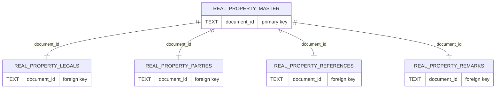
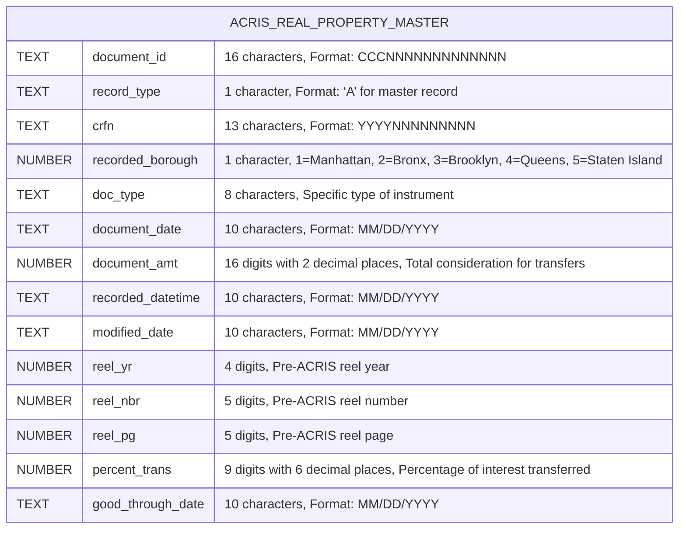
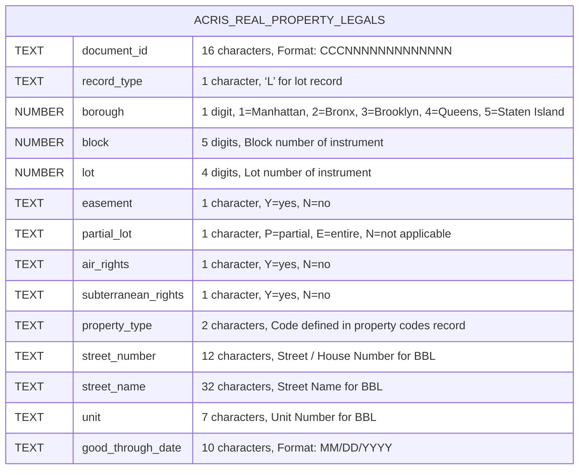
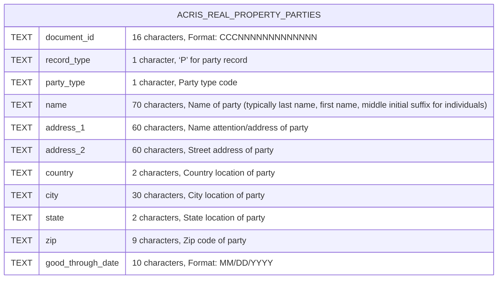
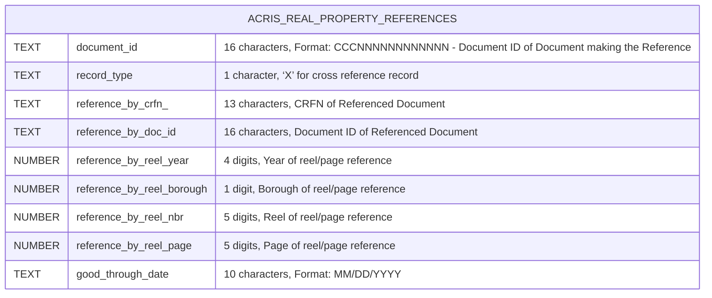
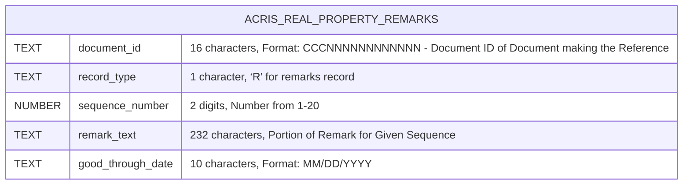

# REAL PROPERTY API NOTES

## Table of Contents

- [REAL PROPERTY API NOTES](#real-property-api-notes)
  - [Table of Contents](#table-of-contents)
- [API File Architecture](#api-file-architecture)
  - [Real Property Overview](#real-property-overview)
  - [`MasterRealPropApi`](#masterrealpropapi)
    - [NYC Open Data URL: http://data.cityofnewyork.us/City-Government/ACRIS-Real-Property-Master/bnx9-e6tj](#nyc-open-data-url-httpdatacityofnewyorkuscity-governmentacris-real-property-masterbnx9-e6tj)
    - [NYS OPEN DATA Name: ACRIS - Real Property Master](#nys-open-data-name-acris---real-property-master)
    - [NYS OPEN DATA Description: Master document Details for Real Property Related Documents Recorded in ACRIS](#nys-open-data-description-master-document-details-for-real-property-related-documents-recorded-in-acris)
    - [API Endpoint URL: https://data.cityofnewyork.us/resource/bnx9-e6tj.json](#api-endpoint-url-httpsdatacityofnewyorkusresourcebnx9-e6tjjson)
  - [`LegalsRealPropApi`](#legalsrealpropapi)
    - [NYC Open Data URL: https://data.cityofnewyork.us/City-Government/ACRIS-Real-Property-Legals/8h5j-fqxa/about\_data](#nyc-open-data-url-httpsdatacityofnewyorkuscity-governmentacris-real-property-legals8h5j-fqxaabout_data)
    - [NYS OPEN DATA Name: ACRIS - Real Property Legals](#nys-open-data-name-acris---real-property-legals)
    - [NYS OPEN DATA Description: Property Details for Real Property Related Documents Recorded in ACRIS](#nys-open-data-description-property-details-for-real-property-related-documents-recorded-in-acris)
    - [API Endpoint URL: https://data.cityofnewyork.us/resource/8h5j-fqxa.json](#api-endpoint-url-httpsdatacityofnewyorkusresource8h5j-fqxajson)
  - [`PartiesRealPropApi`](#partiesrealpropapi)
    - [NYC Open Data URL: https://data.cityofnewyork.us/City-Government/ACRIS-Real-Property-Parties/636b-3b5g/about\_data](#nyc-open-data-url-httpsdatacityofnewyorkuscity-governmentacris-real-property-parties636b-3b5gabout_data)
    - [NYS OPEN DATA Name: ACRIS - Real Property Parties](#nys-open-data-name-acris---real-property-parties)
    - [NYS OPEN DATA Description: Party Names for Real Property Related Documents Recorded in ACRIS](#nys-open-data-description-party-names-for-real-property-related-documents-recorded-in-acris)
    - [API Endpoint URL: https://data.cityofnewyork.us/resource/636b-3b5g.json](#api-endpoint-url-httpsdatacityofnewyorkusresource636b-3b5gjson)
  - [`ReferencesRealPropApi`](#referencesrealpropapi)
    - [NYC Open Data URL: https://data.cityofnewyork.us/City-Government/ACRIS-Real-Property-References/pwkr-dpni/about\_data](#nyc-open-data-url-httpsdatacityofnewyorkuscity-governmentacris-real-property-referencespwkr-dpniabout_data)
    - [NYS OPEN DATA Name: ACRIS - Real Property References](#nys-open-data-name-acris---real-property-references)
    - [NYS OPEN DATA Description: Document Cross References for Real Property Related Documents Recorded in ACRIS](#nys-open-data-description-document-cross-references-for-real-property-related-documents-recorded-in-acris)
    - [API Endpoint URL: https://data.cityofnewyork.us/resource/pwkr-dpni.json](#api-endpoint-url-httpsdatacityofnewyorkusresourcepwkr-dpnijson)
  - [`RemarksRealPropApi`](#remarksrealpropapi)
    - [NYC Open Data URL: https://data.cityofnewyork.us/City-Government/ACRIS-Real-Property-Remarks/9p4w-7npp/about\_data](#nyc-open-data-url-httpsdatacityofnewyorkuscity-governmentacris-real-property-remarks9p4w-7nppabout_data)
    - [NYS OPEN DATA Name: ACRIS - Real Property Remarks](#nys-open-data-name-acris---real-property-remarks)
    - [NYS OPEN DATA Description: Document Remarks for Real Property Related Documents Recorded in ACRIS](#nys-open-data-description-document-remarks-for-real-property-related-documents-recorded-in-acris)
    - [API Endpoint URL: https://data.cityofnewyork.us/resource/9p4w-7npp.json](#api-endpoint-url-httpsdatacityofnewyorkusresource9p4w-7nppjson)

# API File Architecture

## Real Property Overview

## `MasterRealPropApi`
### NYC Open Data URL: http://data.cityofnewyork.us/City-Government/ACRIS-Real-Property-Master/bnx9-e6tj
### NYS OPEN DATA Name: ACRIS - Real Property Master
### NYS OPEN DATA Description: Master document Details for Real Property Related Documents Recorded in ACRIS
### API Endpoint URL: https://data.cityofnewyork.us/resource/bnx9-e6tj.json

[Back to TOC](#table-of-contents)

---

## `LegalsRealPropApi`
### NYC Open Data URL: https://data.cityofnewyork.us/City-Government/ACRIS-Real-Property-Legals/8h5j-fqxa/about_data
### NYS OPEN DATA Name: ACRIS - Real Property Legals
### NYS OPEN DATA Description: Property Details for Real Property Related Documents Recorded in ACRIS
### API Endpoint URL: https://data.cityofnewyork.us/resource/8h5j-fqxa.json

[Back to TOC](#table-of-contents)

---

## `PartiesRealPropApi`
### NYC Open Data URL: https://data.cityofnewyork.us/City-Government/ACRIS-Real-Property-Parties/636b-3b5g/about_data
### NYS OPEN DATA Name: ACRIS - Real Property Parties
### NYS OPEN DATA Description: Party Names for Real Property Related Documents Recorded in ACRIS
### API Endpoint URL: https://data.cityofnewyork.us/resource/636b-3b5g.json

[Back to TOC](#table-of-contents)

---

## `ReferencesRealPropApi`
### NYC Open Data URL: https://data.cityofnewyork.us/City-Government/ACRIS-Real-Property-References/pwkr-dpni/about_data
### NYS OPEN DATA Name: ACRIS - Real Property References
### NYS OPEN DATA Description: Document Cross References for Real Property Related Documents Recorded in ACRIS
### API Endpoint URL: https://data.cityofnewyork.us/resource/pwkr-dpni.json

[Back to TOC](#table-of-contents)

---

## `RemarksRealPropApi`
### NYC Open Data URL: https://data.cityofnewyork.us/City-Government/ACRIS-Real-Property-Remarks/9p4w-7npp/about_data
### NYS OPEN DATA Name: ACRIS - Real Property Remarks
### NYS OPEN DATA Description: Document Remarks for Real Property Related Documents Recorded in ACRIS
### API Endpoint URL: https://data.cityofnewyork.us/resource/9p4w-7npp.json

[Back to TOC](#table-of-contents)